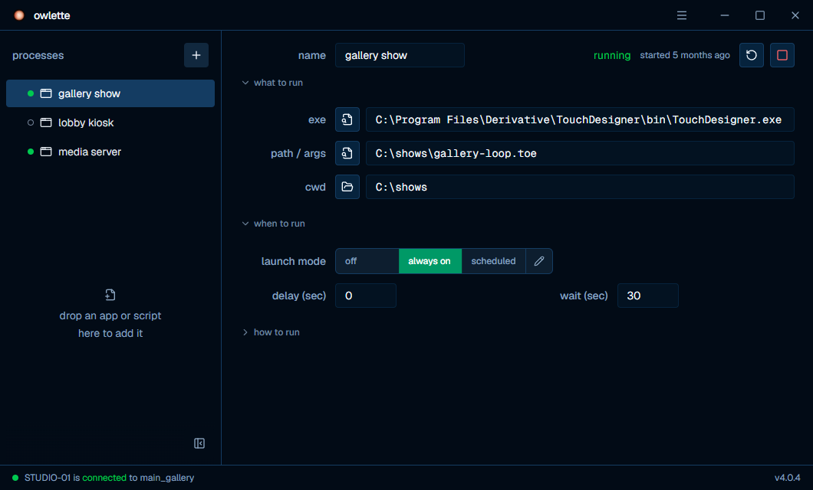

<div align="center">


# owlette

### ai-powered fleet management for Windows, macOS and Linux applications

[](https://github.com/tridant-io/owlette/releases)
[](LICENSE)
[](https://owlette.app)

[live app](https://owlette.app) &nbsp;&bull;&nbsp; [documentation](https://owlette.app/docs) &nbsp;&bull;&nbsp; [download agent](https://owlette.app/download) (picks your platform; `?os=windows|macos|linux` overrides)

</div>

---

owlette is a cloud-connected system for monitoring, managing, and deploying software across fleets of Windows, macOS and Linux machines, from anywhere. a lightweight Python agent runs on each machine as a system service (a Windows service hosted by a small Rust supervisor, `owlette-host`; a launchd daemon on macOS; a systemd unit on Linux), keeps your applications running, reports metrics, and executes commands. a desktop app on each machine shows the same configuration locally. a web dashboard gives you real-time visibility and control over the whole fleet, backed by Firebase, Cloud Firestore and Cloudflare.

built for teams running **digital signage**, **media servers**, **kiosks**, **TouchDesigner installations**, and any application that needs to stay running.

<div align="center">

<p><em>real-time fleet monitoring and control from the owlette web dashboard</em></p>
</div>

## features

**real-time monitoring**
live CPU, memory, disk, GPU, temperature and network metrics, with history and sparkline charts. heartbeat-based online status, process health tracking, crash detection, and remote screenshots.

**process management**
add an app, a script or a TouchDesigner project from the dashboard or by dropping it on the desktop app. each process is off, always on, or on a weekly schedule; owlette relaunches it when it crashes (or, on Windows, stops responding) and restarts the machine when relaunching is not enough.

**swoop: remote desktop**
a machine's screen, live in the browser, with keyboard, mouse and clipboard. watching needs site membership; control needs a site admin and a fresh second factor. off until a site turns it on, every session leased and audited, and an API key can never start one. runs on Windows and macOS.

**remote deployment**
push software silently to any number of Windows machines: NSIS, Inno Setup, MSI, and custom installers. save deployment templates, track progress in real time, and cancel mid-install. the agent itself updates remotely on all three platforms.

**roost: project distribution**
drag a project folder onto the dashboard and it syncs to your fleet. files are split into 4 MiB content-addressed chunks, hashed in the browser, and uploaded once; re-deploys and machines that already hold a chunk skip it. every deploy is an immutable version you can roll back to in one click, and agents verify every chunk by SHA-256 before assembling files atomically into an allowlisted destination.

**hoot: ai assistant**
LLM-powered fleet management in natural language. hoot runs tools on the machines you point it at, in three tiers from read-only diagnostics to privileged operations that wait for your approval. screenshot analysis, autonomous crash investigation, shareable conversations, and Anthropic and OpenAI providers.

**talons: automations**
site-scoped automations: a trigger (a schedule, a machine or process event, a metric threshold), an optional condition, and one or more outputs. hoot can write them for you, and every run is recorded.

**machine care**
restart machines on a weekly schedule in their own timezone, store a machine's monitor layout and restore it when it drifts, and keep screens awake: a site switch that stops every machine sleeping, blanking or locking.

**multi-site access control**
organize machines into sites by location, department or project. roles are per site (member, admin, owner), granted by a membership on each site; a platform superadmin reaches every site. sign-in with email, Google or a passkey, and a required second factor.

**alerts, webhooks and api**
threshold and offline alerts by email, signed webhooks for external systems, and an activity log across the fleet. a public REST API with an [OpenAPI reference](https://owlette.app/docs/api), a command line client (`@owlette/cli`), and SDKs for Node (`@owlette/sdk`) and Python (`owlette-sdk`).

**desktop app**
the local window and tray (menu bar on macOS) icon on each machine: the process list, launch modes and schedules, drag and drop to add a process, joining or leaving a site, and the service's status. light, dark or system appearance, like the dashboard.

> **[full documentation →](https://owlette.app/docs)**

## architecture

control and state flow through Cloud Firestore; there is no persistent connection between agents and the dashboard. Firestore acts as the message bus, with Next.js API routes handling authenticated control actions and Cloud Functions handling fan-out and background work.

bulk file bytes do **not** go through Firestore. roost chunks and version bodies live in object storage (Cloudflare R2); browsers and agents read and write them directly through short-lived, single-object signed URLs minted by the API. a swoop session is a direct WebRTC connection between the browser and the machine, introduced by a Cloudflare signalling worker and relayed through TURN only when no direct path exists.

```
 machines                           cloud                            browser
+---------------------------+    +---------------------------+    +---------------------+
| agent: Windows service /  | -> | Firestore                 | <- | Next.js dashboard   |
| launchd / systemd         | <- | state + command bus       | -> | + REST API          |
| desktop app               |    | Firebase Auth, Functions  |    |                     |
+---------------------------+    +---------------------------+    +---------------------+
       |       |                                                      |        |
       |       +------- roost: Cloudflare R2, signed URLs ------------+        |
       +--------------- swoop: WebRTC, Cloudflare signalling + TURN -----------+
```

- **agent** (`agent/`): Python 3.11 service. monitors processes every 5s, sends heartbeats and metrics on an adaptive interval (5s with the desktop window open, 30s while processes run, 120s idle), executes commands, works offline from cached config.
- **desktop app** (`desktop/`): Tauri 2. the local UI, sharing the service's config file. on macOS and Linux it runs as the signed-in user beside the root daemon, and the two hand each other the work only the other can do: the app captures the screen for the daemon, and the daemon pairs, leaves a site and restarts for the app.
- **dashboard** (`web/`): Next.js 16. real-time Firestore listeners, the REST API, and the docs site at `/docs`.
- **cloud functions** (`functions/`): deployment status, roost fan-out and chunk verification, quotas, threshold alerts, webhook dispatch, and the audit log.
- **object storage**: Cloudflare R2. content-addressed roost chunks and version bodies under a per-site prefix, reachable only through signed URLs.
- **swoop**: the streamer in `agent/swoop` (Rust) and the signalling worker in `infra/swoop-signal`.
- **cli and sdks** (`cli/`, `sdks/`): clients for the public API.

## quick start

### hosted (fastest)

1. create an account at [owlette.app](https://owlette.app)
2. create a **site** to organize your machines
3. download the agent installer from the dashboard. the button picks the file for your platform and offers the other two; [owlette.app/download](https://owlette.app/download) does the same from the browser's user agent, and `?os=windows`, `?os=macos` or `?os=linux` overrides it:
   - Windows 10 or later: `Owlette-Installer-v<version>.exe`
   - macOS 15 or later on Apple silicon: `Owlette-Installer-v<version>.pkg`
   - Linux (Ubuntu 24.04): `Owlette-Installer-v<version>.deb`
4. run the installer on your target machine (Windows as administrator; macOS `sudo installer -pkg … -target /` or double-click; Linux `sudo apt-get install ./Owlette-Installer-v<version>.deb`)
5. a **3-word pairing phrase** appears in the owlette window; authorize it from the dashboard or your phone
6. your machine appears in the dashboard within 30 seconds

> **[full setup guide →](https://owlette.app/docs/getting-started)**

### run from source

each package installs and runs on its own; there is no top-level install for all of them. you need Node.js 22 and npm 10 everywhere, Python 3.11 for the agent, and Rust for the desktop app and the Windows service host.

```bash
# dashboard: http://localhost:3000
cd web
npm ci
cp .env.example .env.local      # fill in from /docs/setup/environment-variables
npm run dev

# agent (Windows): venv at agent/.venv, then the test suite
powershell -File scripts/bootstrap-windows.ps1 -InstallAgentDeps
agent/.venv/Scripts/python -m pytest agent/tests/

# desktop app: compiles the Rust host and opens the window
cd desktop
npm ci
npm run tauri dev
```

per-package detail: [web/README.md](web/README.md), [agent/README.md](agent/README.md) (including macOS and Linux), [desktop/README.md](desktop/README.md). the full first-time path for a maintainer, from toolchain to local env files and CLI logins, is the **[maintainer quickstart](docs/maintainer-quickstart.md)**.

### self-host

running your own instance (Firebase project, Cloudflare R2, Cloud Functions, the web app and its scheduled jobs) is covered in **[self-hosting](https://owlette.app/docs/setup)**. a few values still name owlette.app in code, the agent's server among them; the guide lists them.

## deploy

`dev` deploys to [dev.owlette.app](https://dev.owlette.app) and `main` to [owlette.app](https://owlette.app). all work lands on `dev` first, through a pull request, and `dev` is promoted to `main`.

| what | how it ships |
|------|--------------|
| dashboard, API and docs (`web/`) | Railway deploys on every push: `dev` to dev.owlette.app, `main` to owlette.app. in production a Cloudflare load balancer (`infra/cloudflare`, Terraform) fails over to a Vercel standby when Railway's `/api/health` check fails |
| Firestore rules and indexes, Storage rules | by hand: `firebase deploy --only firestore,storage --project <dev or prod>`, before the web deploy that needs them |
| Cloud Functions (`functions/`) | by hand: `FUNCTIONS_DISCOVERY_TIMEOUT=120 firebase deploy --only functions --project <dev or prod>`, with `functions/.env.<project-id>` present |
| scheduled jobs | registered per environment on an external scheduler (cron-job.org); every job is listed in `infra/cron-jobs.json` |
| swoop signalling worker (`infra/swoop-signal`) | a push to `dev` that touches it deploys the dev worker; production is a manual workflow dispatch |
| agent installers | bump with `node scripts/sync-versions.js X.Y.Z` and add the changelog entry, then tag `vX.Y.Z`: `build-installer.yml` builds the exe, pkg and deb with SLSA L3 provenance and attaches them to the GitHub release. agents only see a version once it is uploaded with `scripts/upload-installer.mjs` |
| CLI and SDKs | tags `cli-vX.Y.Z`, `node-sdk-vX.Y.Z` and `py-sdk-vX.Y.Z` publish to npm and PyPI |

environment variables are registered by name in `scripts/env-manifest.json` and checked across Railway and Vercel with `node scripts/sync-env.mjs`. the step-by-step procedures are in [docs/runbooks](docs/runbooks): [production-deploy.md](docs/runbooks/production-deploy.md), [agent-installer-release.md](docs/runbooks/agent-installer-release.md), [manual-infrastructure.md](docs/runbooks/manual-infrastructure.md) and [hotfix-rollback.md](docs/runbooks/hotfix-rollback.md).

## screenshots

<div align="center">


<p><em>the desktop app on a machine: its processes, what to run, and when</em></p>

</div>

## tech stack

| component | technology |
|-----------|-----------|
| **dashboard** | Next.js 16, React 19, TypeScript, Tailwind CSS 4, shadcn/ui, Fumadocs |
| **agent** | Python 3.11, Windows service hosted by `owlette-host` (Rust) / launchd daemon on macOS / systemd unit on Linux, psutil, pywin32 on Windows |
| **desktop app** | Tauri 2 (Rust), React 19, TypeScript, Tailwind CSS 4 |
| **swoop** | Rust streamer, WebRTC, Cloudflare Workers + Durable Objects for signalling, Cloudflare TURN |
| **database** | Cloud Firestore (real-time NoSQL), Cloud Functions |
| **auth** | Firebase Auth, WebAuthn passkeys, TOTP 2FA, device-code pairing, Cloudflare Turnstile |
| **ai** | Anthropic and OpenAI via the AI SDK, tool-calling |
| **email** | Resend |
| **hosting** | Railway (web), a Vercel standby behind a Cloudflare load balancer, Firebase (Auth, Firestore, Storage, Functions), Cloudflare R2 (roost storage) |

## documentation

full documentation is available at **[owlette.app/docs](https://owlette.app/docs)**.

- [getting started](https://owlette.app/docs/getting-started): first machine in under 5 minutes
- [platform support](https://owlette.app/docs/reference/platform-support): what works on Windows, macOS and Linux
- [agent guide](https://owlette.app/docs/agent): installation, configuration, the desktop app, troubleshooting
- [dashboard guide](https://owlette.app/docs/dashboard): monitoring, process management, sites
- [swoop](https://owlette.app/docs/dashboard/swoop): remote desktop, control, and sessions
- [remote deployment](https://owlette.app/docs/dashboard/deployments): silent software installation across machines
- [roost](https://owlette.app/docs/dashboard/roost): content-addressed project sync, versions, rollback
- [hoot](https://owlette.app/docs/dashboard/hoot) and its [tools](https://owlette.app/docs/reference/hoot-tools): the AI assistant
- [talons](https://owlette.app/docs/dashboard/talons): automations
- [API reference](https://owlette.app/docs/api) and [CLI](https://owlette.app/docs/cli/overview)
- [architecture](https://owlette.app/docs/architecture): system design and data flow
- [authentication](https://owlette.app/docs/reference/authentication): auth methods, device-code pairing, tokens
- [self-hosting](https://owlette.app/docs/setup): Firebase, R2, the web app, and scheduled jobs

## contributing

contributions are welcome. please open an issue or submit a pull request.

**guidelines:**
- fork the repo and create a feature branch from `dev`
- use [conventional commits](https://www.conventionalcommits.org/) (`feat:`, `fix:`, `docs:`, etc.)
- run the tests for what you changed before submitting; the [maintainer quickstart](docs/maintainer-quickstart.md) lists them per package
- use `node scripts/sync-versions.js X.Y.Z` for version bumps
- all PRs merge to `dev` first, then `dev` → `main` for production

**[open an issue →](https://github.com/tridant-io/owlette/issues)**

## license

this project is licensed under the [Functional Source License, Version 1.1, Apache 2.0 Future License](LICENSE) (FSL-1.1-Apache-2.0). you may freely use, modify, and self-host owlette for any purpose other than a competing commercial product or service. two years after each release, that version automatically converts to Apache License 2.0.
