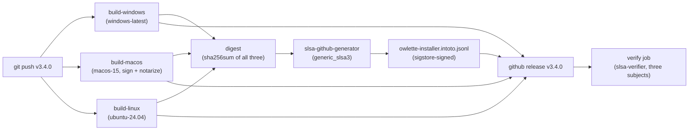

# SLSA Build Level 3 — installer provenance

**Wave 5.8, extended by multi-platform releases 4.2.** Hermetic CI build of the three roost agent installers — the Windows exe, the Apple silicon pkg and the Linux deb — with one signed in-toto provenance, verifiable by anyone with `slsa-verifier`.

## What it proves

For any downloaded `Owlette-Installer-vX.Y.Z.exe`, `.pkg` or `.deb`, a consumer can prove:

1. **Built from this repo** (`github.com/<org>/owlette`) at the exact commit pinned by the tag
2. **Built by this workflow** (`.github/workflows/build-installer.yml`) — not a human laptop
3. **Not tampered with post-build** — the signed hash in the attestation matches the artifact bytes
4. **Built after the source was committed** — the provenance's `finishedOn` timestamp post-dates the tag's commit

SLSA Build L3 is distinct from **authenticode signing** (wave 5.9), which protects against untrusted code execution on Windows. Both ship side-by-side on a released installer — SLSA proves provenance, authenticode unlocks SmartScreen. The pkg is already Developer ID signed, notarized and stapled inside its build job; the attested bytes are the stapled ones.

## How it works



### Job isolation

1. **build-windows / build-macos / build-linux** each run on their own hosted runner and produce one installer. `build-macos` signs the app and the runtime, signs the pkg and notarizes it with the Apple secrets of the `release` GitHub environment, then staples — all before the digest, because signing mutates the bytes. None of the build jobs can touch the provenance signing key.
2. **digest** downloads the three artifacts and emits one base64 `sha256sum` listing, one line per file. This is the subject list the generator attests.
3. **provenance** runs in the `slsa-framework/slsa-github-generator` reusable workflow. It reads the digest job's output, produces one signed in-toto attestation via sigstore + GitHub OIDC, and uploads it to the release. The build jobs cannot impersonate this — OIDC scoping prevents a malicious build step from claiming to be the generator.
4. **verify** runs `slsa-verifier` against all three artifacts + the attestation as a smoke test before the release is considered final.

Everything past the builds needs all three, so a run in which one build fails attests nothing.

## Running a release

```bash
# 1. Update VERSION + changelog + commit (per CLAUDE.md)
node scripts/sync-versions.js 3.4.0
# edit docs/changelog.md, add [3.4.0] entry
git add -A && git commit -m "chore: bump version to 3.4.0"

# 2. Tag + push. The workflow triggers on tag push.
git tag v3.4.0
git push origin main --tags
```

The workflow then:
- Builds the exe on `windows-latest` via `agent/build_installer_full.bat`, the pkg on `macos-15` via `agent/build/macos/build.sh` (signed, notarized, stapled), the deb on `ubuntu-24.04` via `agent/build/linux/build.sh`
- Generates one in-toto provenance over the three files
- Attaches all four to the GitHub release
- Runs `slsa-verifier` smoke to confirm the chain

A `workflow_dispatch` run on a branch exercises the builds without a release. The `release` environment is restricted to `v*` tags, so GitHub refuses `build-macos` on a branch dispatch (and, until the environment exists, the job's first step fails on the missing secret names); `build-windows` and `build-linux` still produce their artifacts, and the digest and provenance jobs do not run.

## Verifying a downloaded installer

Anyone with a downloaded installer and the release URL can verify it. Pass every file you downloaded — one, two or all three — in one call:

```bash
# install slsa-verifier
go install github.com/slsa-framework/slsa-verifier/v2/cli/slsa-verifier@latest

# download the installers and the attestation
gh release download v3.4.0 --repo <org>/owlette

# verify
slsa-verifier verify-artifact \
  Owlette-Installer-v3.4.0.exe \
  Owlette-Installer-v3.4.0.pkg \
  Owlette-Installer-v3.4.0.deb \
  --provenance-path owlette-installer.intoto.jsonl \
  --source-uri github.com/<org>/owlette \
  --source-tag v3.4.0
```

Expected output: `PASSED: Verified SLSA provenance` for each file. Any failure (tampered bytes, wrong source repo, provenance mismatch, a file the attestation does not list) fails with a specific error.

## Supply-chain threat model

| threat | mitigation |
|---|---|
| Attacker replaces an installer on the release CDN | SHA-256 in signed provenance won't match → `slsa-verifier` fails |
| Attacker builds a malicious installer on their laptop and uploads to a fake release | No provenance → verifier fails on missing attestation |
| Attacker modifies the workflow file to upload their own attestation | The attestation is signed by sigstore using GitHub OIDC scoped to the reusable workflow — a modified workflow produces a provenance with different metadata that `--source-uri` / `--source-tag` checks will reject |
| Attacker with write access dispatches the workflow on a tag to sign with the Apple secrets | **Accepted** — the `release` environment is tag-restricted, so a fork PR cannot reach it, but a dispatch on a `v*` tag by anyone with write access can. Stated in the workflow header |
| Dependency poisoning in `choco install innosetup` | **Not mitigated** — Inno Setup is pulled fresh on every run. Pin the version (`--version=6.2.2` in the workflow) and audit updates manually. A future hardening step is to vendor Inno Setup as a stored build asset |
| Attacker compromises the `slsa-github-generator` reusable workflow itself | **Trust boundary** — if SLSA's own workflow is compromised, the provenance chain is broken. This is why we pin the reusable workflow to a specific tag (`@v2.1.0`), not `@main` |

## One-time setup (for the repo maintainer)

- The provenance itself needs nothing: GitHub-hosted runners + the keyless sigstore path need no stored secrets.
- `build-macos` needs the `release` GitHub environment, restricted to `v*` tags, holding the eight Apple secrets listed under `github-repo-secrets` in `scripts/env-manifest.json` (the two Developer ID p12s and their passwords, the team id, and the App Store Connect API key, key id and issuer id).

## Known caveats

- **First tag run**: The first release after this workflow lands may fail the `verify` job if the SLSA rekor transparency log is slow to ingest the attestation (rare, but possible). Re-running the verify job 60 s later typically resolves it.
- **Not authenticode**: This doesn't solve Windows SmartScreen warnings — end users still see "unrecognised publisher" until wave 5.9 lands with the EV cert from wave 0.7.
- **Runner time**: The Windows build takes ~15–20 minutes (Python embedded download, Inno Setup compile, dependency unpacking); the macOS build adds `notarytool --wait` on top of a cold Tauri build. The three run in parallel under a 60-minute cap each. Plan release windows accordingly.

## Follow-ups

- Wave 5.9 (authenticode) wraps the signed installer with a windows-trusted signature for SmartScreen
- Vendor Inno Setup as a build asset to remove the `choco install` supply-chain link
- Add a scheduled verify job that re-checks the latest release's provenance weekly (catches sigstore-side regressions in rekor)
