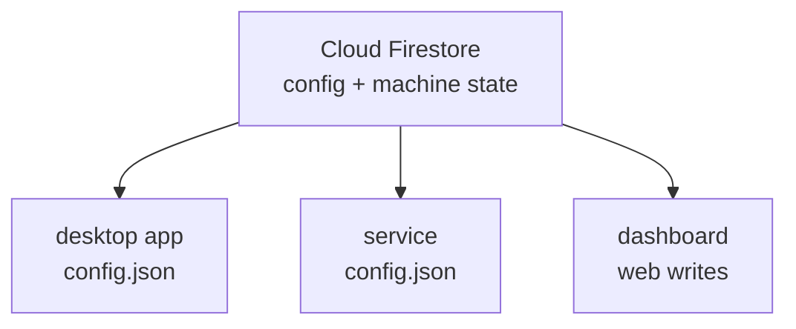

desktop app and dashboard writes apply immediately; the agent picks up config changes on a polling listener with a 2-10 second interval.

when the desktop app is open, launch mode and schedule labels refresh from external dashboard or service changes. text fields that are actively focused defer a remote refresh until focus leaves.

---

## the desktop app

the desktop app runs as a separate process from the service, as the signed-in user. open its window from:

| platform | where |
|----------|-------|
| Windows | the tray icon (a left click, or **open owlette** in its menu), the Start menu's **Owlette**, or `C:\ProgramData\Owlette\app\owlette-desktop.exe` |
| macOS | **open owlette** in the menu-bar icon's menu, or **owlette** in Applications |
| Linux | **open owlette** in the top-bar icon's menu, **owlette** in the app grid, or `owlette-desktop` from a terminal |

on macOS the window keeps the system's own window buttons at top left and shows a Dock icon only while it is open; on Windows and Linux it draws its own minimise, maximise and close controls.


### what the window shows

| area | contents |
|---------|----------|
| **processes list** | every monitored process, in launch order, with a status dot from the service's live table. drag a row to reorder; right-click one for restart, kill, duplicate, and delete. add an entry with the `+` button in the list header, which writes a blank entry straight away, or drop one onto the window: an app, a script, a TouchDesigner project or a Unity build folder on Windows, an app or a TouchDesigner project on macOS, a Python script on Linux. a drop is never written straight through — owlette shows what it read the file as (name, launch target, working directory) for review first, and the entry it adds has its launch mode off |
| **process settings** | the `name` field shares a header row with the process's live status, a `started …` stamp while it is running, and restart and kill buttons — both follow whether the process is running, not its launch mode, so a running process can be restarted or killed in any mode and a stopped one has both greyed out. below sit three collapsible sections: *what to run* (the launch target — `exe` on Windows, `app` on macOS, `program` on Linux — then `path / args` and `cwd`), *when to run* (launch mode, the schedule pencil, `delay (sec)`, `wait (sec)`), and *how to run* (`attempts`, plus `priority` and `visibility` on Windows, the only platform that applies them). the first two open by default; *how to run* holds the tune-once fields and starts folded, and each section remembers whether you left it open. while the launch mode is `off`, the timing fields and the whole *how to run* block are dimmed and its heading adds *· applies once a launch mode is set* — they stay editable, they just do not apply until a mode is set. there is no save button — a text field writes itself when it loses focus or takes an enter key, and the launch mode, priority, and visibility controls write on click |
| **menu** (top right) | the app menu — see [the app menu](#the-app-menu) below |
| **footer** | one sentence saying whether this machine is being supervised and which site it belongs to, plus the version of the *service* that is running. on any owlette but production an amber environment chip sits beside that version — `dev` for a machine bound to dev.owlette.app, the bare host for anything else; a footer with no chip means production. one button sits beside the sentence when the state calls for it: `start service` when nothing is supervising this machine (Windows and Linux; on macOS launchd runs the service and the app cannot start it), or `join site` when the service is running but the machine belongs to no site. the two are mutually exclusive |
| **notices** (macOS) | one notice per missing grant: Screen Recording (no remote screenshots, no swoop picture), Accessibility (swoop can watch but not control) and clipboard sharing (a swoop viewer gets nothing copied on the Mac). each notice's **open system settings** button opens the right pane; see [the Mac's grants](/docs/agent/troubleshooting#the-mac-shows-a-screen-recording-or-accessibility-notice) |

### the app menu

| item | what it does |
|------|--------------|
| **swoop** | open [owlette swoop](/docs/dashboard/swoop#owlette-swoop), the swoop viewer app, on the machine picker of the dashboard this machine is paired with. shown only where owlette swoop is installed |
| **join site** / **leave site** | join a site with a pairing phrase, or leave the one this machine is on. only one of the two is offered, depending on whether the machine belongs to a site |
| **config** | open `config.json` |
| **logs** | open the service's logs folder in the data root |
| **docs** | open these docs |
| **submit bug report** | send a bug report, feature request or feedback, with the machine's metrics and the tail of `service.log` attached |
| **appearance** | `system`, `dark` or `light`. `system`, the default, follows the computer's own appearance; the other two pin the window's theme. it is this app's own setting, apart from the dashboard's |
| **start on login** | whether the app starts with this account's session — the same setting as the tray's, described in [start on login](/docs/agent/system-tray#start-on-login) |
| **restart service** | restart the service without an administrator prompt — described in [restart service](/docs/agent/system-tray#restart-service) |
| **reload window** | rebuild the window from what is on disk |

### what the footer's status word means

the footer resolves to one of seven words, in this order — the first one that fits wins:

| word | what it means | what to do |
|------|---------------|------------|
| `checking` | the app has not heard back from the service yet. | nothing — it resolves within a second or two. |
| `service not running` | the service is stopped, not installed, or running but has not written its status file for over two minutes. either way, nothing is being supervised right now. | `start service` beside the sentence, or `restart service` from the menu. on macOS launchd starts the service again on its own; if it stays down, reinstall. |
| `disabled` | cloud sync is off in `config.json`. a machine that was installed but never paired has no `firebase` section at all, so this is the word it shows — it is not a fault. | `join site` beside the sentence. |
| `removed from site` | cloud sync is on, but the machine is no longer assigned to a site. | `join site` beside the sentence. |
| `connected` | the service is running and reaching owlette. | nothing. |
| `authentication required` | the service could not authenticate with owlette — its stored tokens are missing or rejected. | re-pair the machine; see [agent troubleshooting](/docs/agent/troubleshooting#agent-not-authenticated-error). |
| `disconnected` | the service is running but not reaching owlette. | check the machine's internet connection and its outbound HTTPS to the configured host. |

the status dot and the word share one tone: muted for `checking` and `disabled`, green for `connected`, amber for `authentication required`, and red for the rest.

nothing has been configured yet on a freshly enrolled machine:


the menu at the top right is where a machine joins its first site, or leaves the one it is on:


joining shows a pairing phrase to approve from any device — the same device-code flow the installer uses. from the app, a machine pairs with the server its configuration is already bound to, and a machine that never paired pairs with owlette.app; on macOS and Linux, pair one with dev.owlette.app through the [pairing preseed](/docs/agent/installation#the-pairing-preseed-macos-and-linux):


leaving is the one destructive local action, and pairing the machine again needs a fresh phrase. on Windows the service is stopped while the machine is deregistered and then started again, and Windows asks you to approve that stop. on macOS and Linux the service carries out the leave itself — it takes the machine off the dashboard, then restarts — with nothing to approve.


---

## config.json

the configuration file is `config/config.json` in the data root:

| platform | path |
|----------|------|
| Windows | `C:\ProgramData\Owlette\config\config.json` |
| macOS | `/Library/Application Support/Owlette/config/config.json` |
| Linux | `/var/lib/owlette/config/config.json` |

on macOS and Linux it is owned by root and the owlette group (`_owlette` or `owlette`), and writable by both, which is how the desktop app edits it as the signed-in user.

when no config exists, the agent generates this default structure:

```json
{
    "version": "1.7.0",
    "environment": "production",
    "processes": [],
    "logging": {
        "level": "INFO",
        "max_age_days": 90,
        "firebase_shipping": {
            "enabled": false,
            "ship_errors_only": true
        }
    },
    "sentry": {
        "enabled": false,
        "dsn": ""
    },
    "displays": {
        "enabled": true,
        "assigned": null,
        "remoteApplyEnabled": false
    },
    "temperature": {
        "enabled": true
    },
    "watchdog": {
        "enabled": true,
        "thresholds": {
            "failure_seconds": 360,
            "boot_grace_seconds": 180
        },
        "budget": {
            "max_per_window": 3,
            "window_seconds": 3600
        },
        "preconditions": {
            "require_internet": true,
            "fatal_error_suppression_seconds": 3600
        }
    }
}
```

if the agent regenerates a config and an existing `firebase` section is present, it preserves that section so pairing credentials are not lost.

### top-level fields

| field | type | editable | description |
|-------|------|----------|-------------|
| `version` | string | no | config schema version. the agent upgrades older configs to the current schema. |
| `environment` | string | yes | `production` uses owlette.app; `development` uses dev.owlette.app. it stays on this machine and is never synced. |
| `processes` | array | yes | monitored process entries. the generator starts with an empty array. |
| `logging` | object | yes | local log level, retention, and optional Firebase log shipping. |
| `sentry` | object | yes | optional Sentry reporting settings. local to this machine. |
| `displays` | object | yes | display-topology monitoring and remote apply settings, plus `autoRestore`, which the dashboard's [displays](/docs/dashboard/displays) panel writes. |
| `temperature` | object | yes | CPU and GPU temperature sensor reads (3.2.0+). `enabled: false` stops all sensor reads; a missing section means enabled. takes effect within one metrics tick — no restart needed. |
| `watchdog` | object | yes | service watchdog thresholds, restart budget, and restart preconditions. |
| `firebase` | object | no | pairing and cloud-sync state. the agent may preserve or write this section, but users should not edit it manually. |

### logging fields

| field | type | default | description |
|-------|------|---------|-------------|
| `logging.level` | string | `"INFO"` | log level: `DEBUG`, `INFO`, `WARNING`, `ERROR`, or `CRITICAL`. `DEBUG` also turns on the swoop streamer's per-frame counters from its next session. |
| `logging.max_age_days` | number | `90` | delete local log files older than this many days. |
| `logging.firebase_shipping.enabled` | boolean | `false` | sends buffered logs to Firebase when enabled. |
| `logging.firebase_shipping.ship_errors_only` | boolean | `true` | when shipping is enabled, sends only error and critical logs unless set to `false`. |

### user-editable sections

| section | keys |
|---------|------|
| `environment` | `"production"` or `"development"` |
| `sentry` | `enabled`, `dsn` |
| `displays` | `enabled`, `assigned`, `remoteApplyEnabled` |
| `temperature` | `enabled` |
| `watchdog.thresholds` | `failure_seconds`, `boot_grace_seconds` |
| `watchdog.budget` | `max_per_window`, `window_seconds` |
| `watchdog.preconditions` | `require_internet`, `fatal_error_suppression_seconds` |

---

## process configuration

a process's launch mode is the first thing to set: `off` leaves it alone, `always on` keeps it running around the clock and relaunches it if it crashes, and `scheduled` runs it inside the windows you define.


the pencil button on the right edge of the launch-mode control opens the schedule editor. it is offered in every launch mode — editing from `off` or `always on` stores the windows without changing the mode. windows are wall-clock times: by default they run on the machine's own clock, so a 9am window means 9am where the machine sits, even for a fleet spread across timezones. a site that has opted in to site time is the exception — its machines evaluate windows in the site's timezone instead. see [timezones](/docs/dashboard/timezones) for which parts of owlette use site time:


*how to run* holds the fields you set once and rarely revisit, so it starts folded. open it to reach attempts and, on Windows, priority and visibility:


each process in the `processes` array uses the current process keys. the generator creates an empty array; entries created in the desktop app and entries created from the dashboard share most fields but are not identical.

desktop-app-created entry:

```json
{
    "id": "b8f1a4d2-8b1e-4df9-b7ff-7d4c3c10f9f1",
    "name": "TouchDesigner",
    "exe_path": "C:\\Program Files\\Derivative\\TouchDesigner\\bin\\TouchDesigner.exe",
    "file_path": "C:\\Projects\\MyProject.toe",
    "cwd": "C:\\Projects",
    "priority": "Normal",
    "visibility": "Normal",
    "time_delay": "0",
    "time_to_init": "10",
    "relaunch_attempts": "5",
    "launch_mode": "off",
    "autolaunch": false,
    "schedules": null
}
```

dashboard-created entry:

```json
{
    "id": "b8f1a4d2-8b1e-4df9-b7ff-7d4c3c10f9f1",
    "processId": "b8f1a4d2-8b1e-4df9-b7ff-7d4c3c10f9f1",
    "name": "TouchDesigner",
    "exe_path": "C:\\Program Files\\Derivative\\TouchDesigner\\bin\\TouchDesigner.exe",
    "file_path": "C:\\Projects\\MyProject.toe",
    "cwd": "C:\\Projects",
    "priority": "Normal",
    "visibility": "Normal",
    "time_delay": "0",
    "time_to_init": "10",
    "relaunch_attempts": "3",
    "launch_mode": "off",
    "autolaunch": false,
    "schedules": null
}
```

dashboard writes include `schedulePresetId` only when a schedule preset is supplied.

### process fields

| field | type | description |
|-------|------|-------------|
| `id` | string | stable UUID for the process entry. |
| `processId` | string | public/API process ID. current server write paths keep it in lockstep with `id`; legacy local entries may omit it until normalized. |
| `name` | string | display name for the process. |
| `exe_path` | string | what to launch: the full path to an executable or script on Windows, an `.app` bundle, a program or a script on macOS (e.g. `/Applications/TouchDesigner.app`), a program or script on Linux (e.g. `/usr/bin/your-program`). |
| `file_path` | string | file to open with the executable, or command-line arguments when the value is not a file on disk. |
| `cwd` | string or null | working directory. empty string and null are treated as unset. |
| `priority` | string | Windows only: the CPU priority class. the desktop app exposes `Low`, `Normal`, `High`, and `Realtime`. ignored on macOS and Linux. |
| `visibility` | string | Windows only: the window state used by the launcher; see the accepted values below. ignored on macOS and Linux. |
| `time_delay` | string or number | seconds to wait before launching this process during startup or scheduled activation. |
| `time_to_init` | string or number | seconds to wait after launch before monitoring responsiveness. |
| `relaunch_attempts` | string or number | relaunch attempts allowed before owlette escalates to a machine restart. `0` means unlimited — the process is relaunched forever and no restart is ever raised. a missing, blank, negative, or non-numeric value falls back to the default of 3. what the escalation does on each platform is in [relaunch limits](/docs/agent/process-monitoring#relaunch-limits). |
| `launch_mode` | string | `off`, `always`, or `scheduled`. |
| `autolaunch` | boolean | backward-compatible flag derived from `launch_mode`. keep it aligned with `launch_mode != "off"`. |
| `schedules` | array or null | schedule blocks for `launch_mode: "scheduled"`. null means no schedule is configured. |
| `schedule` | object or null | legacy/API schedule wrapper with `mode` and optional `blocks`; current dashboard writes use `launch_mode` plus `schedules`. |
| `schedulePresetId` | string or null | optional site schedule preset ID associated with the saved schedule. |

for an executable that commonly runs many instances at once — `node.exe`, `python.exe`, `TouchDesigner.exe` — `file_path` (the desktop app's `path / args` field) does more than pass an argument: because the value appears in the process's command line, it is what lets owlette identify this entry's process among look-alikes before it has ever launched it. with it blank, owlette does not guess between identical instances — it launches its own instance and manages that. see [managed or inherited](/docs/agent/process-monitoring#managed-or-inherited).

### visibility options

Windows only. the desktop app exposes `Normal` and `Hidden`. the launcher also accepts `Minimized` and `Maximized` when a process entry is edited manually.

| value | description |
|-------|-------------|
| `"Normal"` | standard visible window. |
| `"Hidden"` | hidden process. console apps are launched without a visible console window. |
| `"Minimized"` | visible window starts minimized. |
| `"Maximized"` | visible window starts maximized. |

`Show` and `Hide` values are normalized by the service to `Normal` and `Hidden`.

---

## web-based configuration

from the dashboard, you can edit process settings remotely:

1. click on a machine in the dashboard.
2. click the process row's pencil/edit button.
3. edit settings such as name, paths, delays, launch mode, and schedules — and on a Windows machine, priority and visibility.
4. click `save changes`.

the dashboard writes process updates to Firestore. the agent listener applies the new configuration locally and writes the updated config file without requiring a service restart. see [process management](/docs/dashboard/process-management).

---

## configuration sync



- **desktop app -> service**: the desktop app writes to `config.json`; the service detects the file change.
- **service -> Firestore**: the service uploads local config changes.
- **Firestore -> service**: the service listener applies remote config changes.
- **dashboard -> Firestore**: the dashboard writes config changes directly to Firestore.
- **hash tracking** prevents feedback loops when a local config change is echoed back from Firestore.
- `firebase`, `sentry` and `environment` stay on the machine: they are never uploaded, and a remote change never overwrites them.

<Callout type="warning" title={"don't modify the firebase section remotely"}>

the `firebase` section of `config.json` is protected. remote config updates never overwrite it. changing it manually can break the agent's connection to Firestore.

</Callout>
