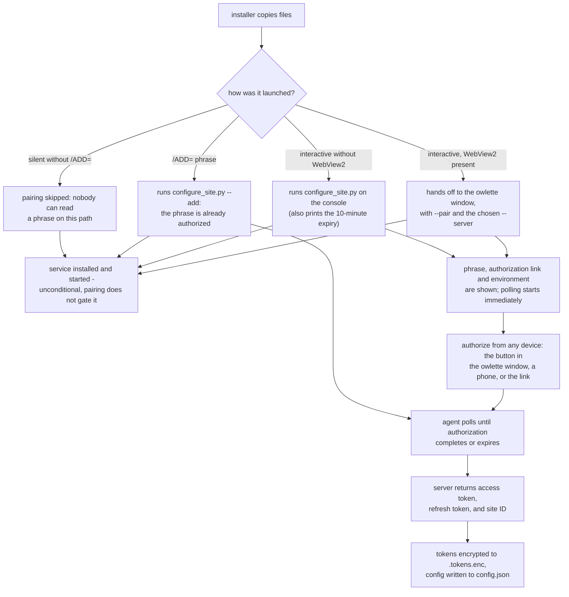

there are four supported ways to install or update the agent:

1. an interactive install on a single machine
2. an unattended install with a phrase generated in the dashboard — `/ADD=` on Windows, the pairing preseed on macOS and Linux
3. remote deployment to machines that already run the agent
4. a manual repair of a packaged install, or a source checkout for development

---

## the installer files

one version carries up to three files, keyed by the same platform key the fleet reports for a machine:

| platform | key | file |
|----------|-----|------|
| Windows 10 or later, 64-bit | `windows_x64` | `Owlette-Installer-v<version>.exe` |
| macOS 15 or later, Apple silicon | `macos_arm64` | `Owlette-Installer-v<version>.pkg` |
| Ubuntu 24.04 | `linux_x64` | `Owlette-Installer-v<version>.deb` |

the dashboard's download button detects the platform you are browsing from and offers the other two in a menu; a platform the current version has no file for is disabled there, with the reason. the permalink `https://owlette.app/download` picks the file from your browser's User-Agent, and `?os=windows`, `?os=macos` or `?os=linux` overrides it — a client it cannot identify gets the Windows exe, and a platform the version has no file for answers `404 no <os> build in v<version>`. Intel Macs are not supported: the pkg refuses them.

what each platform can do once installed is in [platform support](/docs/reference/platform-support).

---

## method 1: interactive packaged install

download the file for the machine's platform, run it with administrator rights, and authorize the machine with the device-code pairing flow.

### Windows

1. log into the owlette dashboard.
2. click the download button in the header bar.
3. save the Windows installer (the `.exe` above) to the target machine.
4. right-click the installer and select **Run as administrator**.
5. follow the installer wizard.
6. the owlette window opens on **join a site**, showing the pairing phrase, the authorization link for the server you installed against, and the environment it belongs to. the agent starts polling immediately. there is no console.
7. authorize the machine: click **open owlette.app/add** in that window to pair from this machine — the button names `dev.owlette.app` on a `/SERVER=dev` install — or visit the displayed link from your phone or another computer and enter the phrase. pairing completes within seconds of approval.
8. meanwhile the installer registers and starts the Windows service. this is unconditional — a machine that is never paired still ends up with a running service, it simply has no site to talk to yet.
9. click Finish. there is no **open owlette** checkbox on this path — the window it would open is already on screen. the wizard offers that checkbox only when it never handed off to the app: an interactive install that paired on the console instead (the WebView2 runtime is still missing after the bundled bootstrapper runs, or the desktop app is not there to launch), an interactive `/ADD=` install, or an upgrade that skips pairing because the machine is already paired to this server. silent installs never see it.


pairing phrases expire after 10 minutes. credentials are stored encrypted at `C:\ProgramData\Owlette\.tokens.enc`.

> **kiosks, signage, media servers, and headless or RDP machines:** nothing opens a browser on the target machine on its own. the phrase and its link are displayed, polling starts, and you authorize from your phone or another computer. `--no-browser` and `OWLETTE_NO_BROWSER=1` are still accepted by `configure_site.py` so existing deployment scripts keep working, but they no longer change anything. for machines nobody is standing in front of, enroll with `/ADD=` instead — see [method 2](#method-2-silent-install-with-add).

### macOS

Apple silicon only, macOS 15 or later. the package is signed and notarized.

1. download the `.pkg` from the dashboard (the download button offers **macOS (apple silicon)** from a Mac, or from the menu elsewhere).
2. double-click the package and approve it with an administrator's password, or install it from a terminal:

    ```bash
    sudo installer -pkg Owlette-Installer-v<version>.pkg -target /
    ```

    the package installs the service under `/Library/Application Support/Owlette` and the app in `/Applications`, starts both, and adds the account signed in at the Mac to the `_owlette` group, which is how the app reaches the service. another account that will run the app — a kiosk account, or a Mac installed from the login window — needs adding by hand, and the membership applies once that account signs out and in again:

    ```bash
    sudo dseditgroup -o edit -a <account> -t user _owlette
    ```
3. grant **Screen Recording** to the owlette app when macOS asks, then quit and reopen owlette; the app shows a notice until it is granted. [swoop](/docs/dashboard/swoop#on-macos) needs three more grants, each given at the Mac: **Accessibility**, to control it, asked only from the app's notice; **Local Network**, which macOS asks for at the first swoop session; and, for the clipboard from the Mac, owlette set to always allow under **Paste from Other Apps** — macOS lists an app there only after it has raised the paste alert once, which the app's clipboard notice does when you click its button.
4. pair it. the app starts in the menu bar rather than as a window: click the owlette icon in the menu bar, choose **open owlette**, then **join site** in the window's footer. the phrase and its link are shown there, and you authorize as in the Windows steps above. from the app a new machine pairs with owlette.app; to pair one with dev.owlette.app, use the [pairing preseed](#the-pairing-preseed-macos-and-linux) with `"server": "dev"`.

### Linux

Ubuntu 24.04. install with `apt-get`, not `dpkg -i`: the package declares dependencies and `dpkg` resolves none of them.

```bash
sudo apt-get install ./Owlette-Installer-v<version>.deb
```

the package is `owlette-agent`. it installs the service as `owlette-agent.service` and starts it, enables the app for every graphical login through the user unit `owlette-desktop.service`, and adds a polkit rule that lets the `owlette` group start, stop and restart the service without `sudo`.

**the app runs only for accounts in the `owlette` group.** the package adds the account that ran `sudo`. a kiosk account that did not run the install has to be added by hand, and group membership applies from that account's next login — log out and back in, or reboot, if the app does not appear after a first install:

```bash
sudo usermod -aG owlette <account>
```

then pair from the app: click the owlette icon in the top bar, choose **open owlette**, then **join site** in the window's footer. as on macOS, the app pairs a new machine with owlette.app; use the [pairing preseed](#the-pairing-preseed-macos-and-linux) for dev.owlette.app, or for a machine nobody is standing in front of.

**no screenshots on Linux yet.** the machine's menu still shows **live view** and **screenshot**, but both fail on Linux for now: the machine refuses every capture, crash screenshots included, rather than send a black frame. it cannot host swoop either — see [platform support](/docs/reference/platform-support#screens).

**Ubuntu Server, or any box without a desktop:** the service runs the same; the app's user unit is tied to the graphical session, so with no desktop it never starts and never fails. metrics, remote commands and roost work. managed processes do not start: off Windows they run as the user signed in at the desktop, and with nobody there the agent launches none. hoot works, since its tools run in the service, apart from `show_notification`, which needs the owlette app running in a desktop session; [local hoot](/docs/dashboard/hoot#local-hoot-public-conversations-api-only) runs as the signed-in user and does not start. pair with the preseed, or afterwards from a shell:

```bash
cd /opt/owlette/agent/src && sudo /opt/owlette/python/bin/python3 configure_site.py --add <phrase>
```

`<phrase>` is one generated in the dashboard, as in method 2. without `--add` the script requests a phrase of its own, prints it with its link, and polls; add `--server dev` to pair with dev.owlette.app.

---

## method 2: silent install with `/ADD=`

use this path for machines nobody is standing in front of. an admin generates a phrase in the dashboard, which is authorized for the site from the moment it exists, and the install pairs with it without anyone at the machine: Windows takes it as the installer's `/ADD=` flag, macOS and Linux from a pairing preseed placed before the install.

**one phrase pairs one machine.** the first machine to pair with a generated phrase spends it, and a phrase nobody spends expires 10 minutes after it was generated. for a batch, generate one phrase per machine.


### generate a phrase

1. in the dashboard, click the `+` (**add machine**) button next to the view toggle.
2. open **generate code**, and click **generate code**.
3. copy the pairing phrase, for example `silver-compass-drift`, or on Windows the whole **silent install command**.

### Windows: `/ADD=`

run the installer on the target machine with the phrase:

```cmd
Owlette-Installer-v<version>.exe /ADD=silver-compass-drift /SILENT
```

for a fully quiet install:

```cmd
Owlette-Installer-v<version>.exe /ADD=silver-compass-drift /VERYSILENT /SUPPRESSMSGBOXES /NORESTART
```

the installer passes `/ADD=` to `configure_site.py --add`. the agent polls `/api/agent/auth/device-code/poll` with the phrase and completes as soon as the server returns tokens.

| flag | description |
|------|-------------|
| `/ADD=phrase` | preauthorized pairing phrase for silent enrollment |
| `/SERVER=prod` | use `https://owlette.app/api`; this is the default |
| `/SERVER=dev` | use `https://dev.owlette.app/api` |
| `/SILENT` | minimal UI with progress only |
| `/VERYSILENT` | no installer UI |
| `/SUPPRESSMSGBOXES` | suppress message boxes |
| `/DIR="C:\path"` | custom install directory |
| `/NORESTART` | do not restart after installation |
| `/LOG="C:\path\setup.log"` | write an Inno Setup log to the chosen path |

example for the dev environment:

```cmd
Owlette-Installer-v<version>.exe /SERVER=dev /ADD=silver-compass-drift /VERYSILENT /SUPPRESSMSGBOXES /NORESTART
```

### the pairing preseed (macOS and Linux)

the macOS and Linux equivalent of `/ADD=`: write the phrase to `config/pairing.json` in the data root before you install, and the package pairs in the background right after installing. it works the same from a terminal or from an MDM, as long as the file is in place before the package runs and the package runs within the phrase's 10 minutes.

```bash
# linux
sudo mkdir -p /var/lib/owlette/config
echo '{"phrase": "silver-compass-drift"}' | sudo tee /var/lib/owlette/config/pairing.json
sudo apt-get install ./Owlette-Installer-v<version>.deb

# macos
sudo mkdir -p "/Library/Application Support/Owlette/config"
echo '{"phrase": "silver-compass-drift"}' | sudo tee "/Library/Application Support/Owlette/config/pairing.json"
sudo installer -pkg Owlette-Installer-v<version>.pkg -target /
```

| key | required | what it does |
|-----|----------|--------------|
| `phrase` | yes | the phrase generated in the dashboard |
| `server` | no | `"dev"` pairs with dev.owlette.app, `"prod"` with owlette.app. without it, a machine that was never paired pairs with owlette.app |
| `kiosk_user` | no | the account the app will run as, reported in the pairing log. it does not add the account to the group — do that by hand, as in [macOS](#macos) and [Linux](#linux) above |

the file must be a plain file owned by root — writing it with `sudo`, as above, does that; a link, or a file owned by any other account, is ignored and the machine is left to pair from the app. once the machine has paired, the file is renamed `pairing.json.used`, so a reinstall cannot spend it again. a phrase that fails — expired, already spent — leaves the file where it is for you to replace. a machine that already belongs to a site is never re-paired by a preseed. the pairing's output goes to `logs/pairing.log` in the data root.

---

## method 3: remote deployment or upgrade

remote deployment requires a target machine that already has a running owlette agent. the agent receives an `install_software` command, downloads the installer, verifies its SHA-256 checksum, and then runs it with the provided silent flags. this path runs a Windows installer. to upgrade the agent itself on any platform, use **update owlette** on the deploy page, which sends each machine the file for its own platform — see [self-update](/docs/agent/self-update).

fields for an owlette agent upgrade through `install_software`:

| field | required | notes |
|-------|----------|-------|
| `installer_url` | yes | direct URL to the installer `.exe` |
| `installer_name` | no | defaults to `installer.exe` when omitted |
| `silent_flags` | no | installer flags such as `/VERYSILENT /SUPPRESSMSGBOXES /NORESTART` |
| `sha256_checksum` | yes | 64-character SHA-256 of the installer; the agent refuses remote installs without it |
| `verify_path` | no | optional path checked after installation |
| `timeout_seconds` | no | defaults to 2400 seconds |

example command payload:

```json
{
  "installer_url": "https://downloads.example.com/Owlette-Installer.exe",
  "installer_name": "Owlette-Installer.exe",
  "silent_flags": "/VERYSILENT /SUPPRESSMSGBOXES /NORESTART /SERVER=prod",
  "sha256_checksum": "<64-character sha256>",
  "verify_path": "C:\\ProgramData\\Owlette\\agent\\src\\owlette_service.py",
  "timeout_seconds": 2400
}
```

in the dashboard's deployment flow, provide the installer URL, silent flags, an optional verify path from a preset or template, and the target machines. the dialog computes `sha256_checksum` server-side as soon as an installer URL is entered, and falls back to a manual hex field for URLs the web server cannot reach; a deployment cannot be submitted without one. see [deployments](/docs/dashboard/deployments).

---

## method 4: manual packaged repair or source development

there are two distinct manual flows.

### repairing a packaged install

on Windows, use the repair script only on a machine that already has the packaged layout under `C:\ProgramData\Owlette`. the service installer script expects the bundled Python, the service host, scripts, and agent source in that layout:

- `C:\ProgramData\Owlette\python\python.exe`
- `C:\ProgramData\Owlette\tools\owlette-host.exe`
- `C:\ProgramData\Owlette\scripts\install.bat`
- `C:\ProgramData\Owlette\agent\src\owlette_runner.py`

to re-run pairing, open the owlette window on the machine and choose **join site** — from the app menu, or from the button in the status bar when the machine belongs to no site. a machine that still belongs to a site offers **leave site** in the app menu instead: leave first, then join. both run the same `configure_site.py` helper the installer does.

leaving is not the mirror of joining, and it differs by platform:

- **Windows:** the app stops `OwletteService` before anything is deregistered, and since it runs as the signed-in user, Windows raises an administrator prompt for that stop — decline it and the leave is cancelled with nothing on this machine changed, and the dialog offers **try again**. with the service down the machine is deregistered, then the service is started again; the dialog narrates each step and the whole sequence takes a few seconds. if the service does not come back, the dialog says so and **start service** appears in the status bar.
- **macOS and Linux:** the service carries out the whole leave itself — it takes the machine off the dashboard, then restarts. there is no prompt, and nothing to approve.

the console equivalent of join, on Windows:

```cmd
cd /d C:\ProgramData\Owlette
python\python.exe agent\src\configure_site.py
```

on macOS and Linux, run the same script as root with the bundled Python — see [agent troubleshooting](/docs/agent/troubleshooting#agent-not-authenticated-error) for the per-platform command.

to repair the Windows service registration, from an elevated command prompt — the script stops with an error without administrator rights:

```cmd
cd /d C:\ProgramData\Owlette
scripts\install.bat
```

on macOS and Linux, installing the same package again is the repair — `sudo installer -pkg …` as before on a Mac, and `sudo apt-get install --reinstall ./Owlette-Installer-v<version>.deb` on Linux, since apt skips a version that is already installed. either keeps everything in the data root.

### source clone for development

a raw source clone does not include the packaged `python\`, `tools\`, or installed service layout. use it for development, testing, or building a new installer package:

```cmd
git clone https://github.com/tridant-io/owlette.git
cd owlette\agent
python -m pip install -r requirements.txt
```

do not run `agent\scripts\install.bat` directly from a raw clone unless you have first built or staged the same packaged layout that the installer creates. the macOS and Linux packages are built with `agent/build/macos/build.sh` and `agent/build/linux/build.sh`.

---

## how pairing works

on Windows the installer chooses a pairing path after copying files, then installs the service. the service install is unconditional: pairing no longer gates it, so an unpaired machine still ends up supervised. pairing itself is skipped in two cases: an upgrade — a valid site configuration already bound to the requested server — and a silent install with no `/ADD=` phrase, where nobody could read a phrase anyway.



the macOS and Linux packages always install and start the service and the app. after that, a pairing preseed pairs the machine in the background; without one, the machine waits, supervised and unpaired, until someone joins a site from the app. either way the pairing itself is the same device-code flow, and the tokens land in `.tokens.enc` in the data root.

authorization options:

| method | when to use |
|--------|-------------|
| owlette window | a single machine. on Windows the installer opens **join a site**; on macOS and Linux open the app from the menu bar or top bar and choose **join site**. the window shows the phrase and a button that opens the pairing page on this machine |
| another device | headless or RDP machines, or kiosks showing live content — read the phrase from the window or console and authorize from your phone or another computer. `--no-browser` and `OWLETTE_NO_BROWSER=1` are still accepted for compatibility but no longer change anything |
| `/ADD=` | Windows: an unattended install with a phrase generated in the dashboard |
| pairing preseed | macOS and Linux: an unattended install with a phrase generated in the dashboard |

---

## post-installation verification

after installation, check that the agent is running.

### check the service

| platform | how |
|----------|-----|
| Windows | open Services (`Win + R`, then `services.msc`), find `OwletteService`, and confirm it is **Running** — or run `sc query OwletteService` |
| macOS | `launchctl print system/app.owlette.agent` shows `state = running` |
| Linux | `systemctl status owlette-agent` shows `active (running)` |

### check logs

the service log is `logs/service.log` in the data root — `C:\ProgramData\Owlette\logs\service.log`, `/Library/Application Support/Owlette/logs/service.log` or `/var/lib/owlette/logs/service.log`. useful startup lines include:

```text
OWLETTE AGENT STARTING - v<version>
STARTUP COMPLETE
Firebase client initialized for site: <site_id>
Firebase client started successfully
owlette initialized
```

on Windows, `service_host.log` beside it is owlette-host's own log: service registration, agent spawns, exit codes, restart backoff, and stop escalations; `service_stdout.log` and `service_stderr.log` are the supervised agent's raw output. every log on every platform is listed in [agent troubleshooting](/docs/agent/troubleshooting#log-locations).

### check the dashboard

the machine should appear in the selected site with:

- online status
- CPU, memory, and disk metrics
- the agent version

### check the tray icon

- **Windows:** the service launches the desktop app in tray mode as soon as an interactive session is available, so the tray icon appears without anyone starting it by hand. the installer also adds a startup shortcut for the installing user; that shortcut is what the **start on login** toggle switches on and off, and turning it off never touches the service. if the icon is not visible, check the hidden-icons overflow menu or launch **Owlette** from the Start menu.
- **macOS:** the owlette eye sits in the menu bar, starting at its right end on first run. launchd starts the app at every login.
- **Linux:** the icon sits in the top bar. if it is missing, run `systemctl --user status owlette-desktop` as the signed-in user: a skipped `ConditionGroup=owlette` means the account is not in the `owlette` group yet — see [Linux](#linux) above.

more in [the system tray](/docs/agent/system-tray).

---

## uninstallation

none of these take the machine off the dashboard. to do that as well, choose **leave site** in the app first, or remove the machine afterwards from its menu on the dashboard — see [remove machine](/docs/dashboard/machine-monitoring#remove-machine).

### uninstall on Windows

use **Windows Settings** > **Apps** > **Owlette** > **Uninstall**.

the uninstaller:

1. closes the desktop app.
2. stops and deregisters `OwletteService` by running `tools\owlette-host.exe uninstall`, which waits for the service to fully stop so the agent can report itself offline first.
3. undoes swoop's machine-wide changes: it removes the `Owlette swoop` firewall rules and puts the `SoftwareSASGeneration` policy back to what it was before swoop set it. a machine that never ran swoop has nothing to undo.
4. removes the Windows Defender exclusions that pre-PawnIO versions added, plus any leftover legacy WinRing0 driver services. the PawnIO driver stays installed — it is a shared component other tools use; remove it separately from installed apps if it is no longer needed.
5. removes installed component directories: `python\`, `agent\`, `app\`, `tools\`, `scripts\` and `swoop\`, along with swoop's own logs (`logs\swoop\`) and scratch files.
6. removes installed top-level files such as `README.md` and `LICENSE`.

by default, it preserves user data under `C:\ProgramData\Owlette`, including `config\`, `logs\`, `cache\`, `tmp\` and `.tokens.enc`.

in non-silent uninstall mode, the uninstaller asks whether to remove all owlette configuration and data files. accept that prompt only when you want a full cleanup. silent uninstalls preserve data for upgrade and repair flows.

### uninstall on macOS

there is no uninstaller for macOS. remove owlette by hand, in this order — it is the same stop the package itself runs before an upgrade:

```bash
# stop the service, and the app for the account you are signed in as
sudo launchctl bootout system/app.owlette.agent
sudo launchctl bootout gui/$(id -u)/app.owlette.desktop

# remove what the package installed, and forget its receipts
sudo rm /Library/LaunchDaemons/app.owlette.agent.plist /Library/LaunchAgents/app.owlette.desktop.plist
sudo rm -rf /Applications/owlette.app "/Library/Application Support/Owlette/runtime"
sudo pkgutil --forget app.owlette.runtime
sudo pkgutil --forget app.owlette.app
```

this leaves the data root, `/Library/Application Support/Owlette`, with the configuration, tokens and logs a reinstall reads back, and the `_owlette` group. delete the folder and the group (`sudo dseditgroup -o delete _owlette`) only for a full cleanup. quit the app from its menu in any other account that is signed in.

### uninstall on Linux

```bash
sudo apt-get remove owlette-agent
```

before its files go, the package stops and disables `owlette-agent.service` and disables the app's user unit for every account. an app already running in a session keeps running until that session ends or you quit it from its menu.

`/var/lib/owlette` — configuration, tokens and logs — stays, and a reinstall reads it back; so does the `owlette` group. delete the folder and the group (`sudo groupdel owlette`) only for a full cleanup.

---

## what the installers contain

### the Windows installer

the Windows installer is built with [Inno Setup](https://jrsoftware.org/isinfo.php) and bundles:

| component | purpose |
|-----------|---------|
| bundled Python | Python runtime; no system Python is needed |
| owlette-host | Windows service host at `C:\ProgramData\Owlette\tools\owlette-host.exe` — registers, starts, stops, and supervises `OwletteService` (replaced NSSM in 3.0.0) |
| agent source | Python modules under `C:\ProgramData\Owlette\agent\src\` |
| desktop app | `C:\ProgramData\Owlette\app\owlette-desktop.exe` — the local configuration window and the tray icon, in one process |
| swoop streamer | `C:\ProgramData\Owlette\swoop\owlette-swoop.exe` |
| WebView2 runtime | Microsoft's Evergreen bootstrapper, run only on machines that lack the runtime the desktop app renders in (common on LTSC/IoT kiosk images) |
| PawnIO driver | signed kernel driver LibreHardwareMonitor uses for CPU temperature sensors, installed only when absent or older than the bundled 2.2.0 (replaced the WinRing0 driver used through 3.1.0) |

before anything else, every install and upgrade retracts the Windows Defender exclusions earlier versions added for the old WinRing0 driver — the PawnIO stack needs none of them, and an upgrade never runs the old uninstaller that would otherwise have cleared them. the removal, and the exclusions left in place afterwards, are appended to `C:\ProgramData\Owlette\logs\defender_setup.log`.

### the macOS package

one product package with two parts: the service runtime — a standalone Python 3.11 with the agent's dependencies and source, under `/Library/Application Support/Owlette/runtime` — with its LaunchDaemon and LaunchAgent, and `owlette.app` in `/Applications`, which carries the swoop streamer inside it. both are signed and notarized. before the payload lands the package stops the running service and app; afterwards it lays out the data root, adds the console user to `_owlette`, loads both jobs and hands any preseed to the pairing flow.

### the Linux package

one `owlette-agent` package: the service runtime with its own Python 3.11 under `/opt/owlette`, the systemd unit, the desktop app at `/usr/bin/owlette-desktop` with the user unit that starts it, and the polkit rule at `/etc/polkit-1/rules.d/49-owlette.rules`. it declares the app's library dependencies and `polkitd`, which is why it has to be installed with `apt-get`. an upgrade stops the service before its files are replaced, then restarts the service and every running copy of the app on the new version.

---

## system requirements

| requirement | minimum |
|-------------|---------|
| OS | Windows 10 or later, 64-bit; macOS 15 or later on Apple silicon; Ubuntu 24.04 |
| RAM | 50 MB agent overhead |
| disk | about 200 MB including the bundled Python |
| network | outbound HTTPS to the configured owlette API and Firebase services |
| permissions | administrator rights (Windows) or `sudo` (macOS, Linux) to install |
| session | a signed-in graphical session for the desktop app and for launching managed processes |
