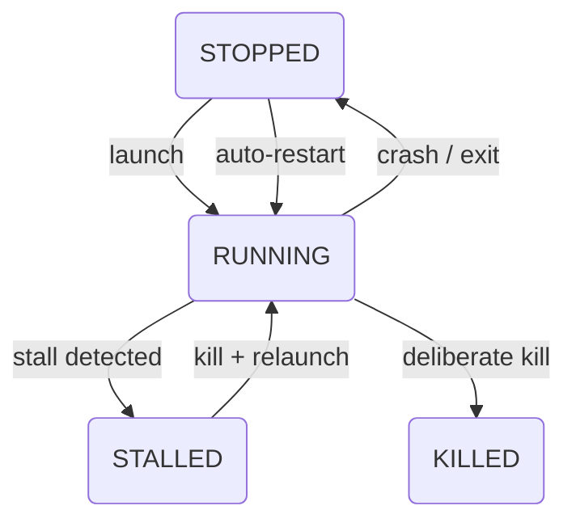

---

## process state machine

the agent reports these process statuses. this diagram shows the common managed-process path. a crash never produces `KILLED` — the service writes no status and logs a `process_crash` event, and once the dead PID is swept out of `app_states.json` the process reports `STOPPED` (launch mode active) or `INACTIVE` (launch mode `off`):



### state definitions

| state | description | dashboard indicator |
|-------|-------------|---------------------|
| **RUNNING** | process is alive and responsive | green |
| **LAUNCHING** | launch is in progress | yellow |
| **RESTARTING** | operator-initiated restart in flight — written by the desktop app before it terminates the PID, so the exit is logged as `process_restarted` rather than raising a crash alert | yellow |
| **QUEUED** | launch is queued or waiting for a delay | yellow |
| **LAUNCH_FAILED** | the executable could not be resolved, a launch failed, or an operation was refused because the process could not be verified as owlette's. clears on the next successful launch | red |
| **STALLED** | Windows only: the process exists but its windows are not responding (hang detected) | yellow |
| **KILLED** | process was deliberately terminated — from the local app, the dashboard, or by the agent before a stall relaunch. the marker only tells the service the exit was intended, so no crash alert is raised; whether the process comes back is decided by its launch mode. the exception is a kill sent from the dashboard, which is not relaunched until an operator starts it or its launch mode is set again | red |
| **STOPPED** | launch mode is active, but no running PID/runtime data is present | red |
| **INACTIVE** | launch mode is `off` and no PID/runtime data is present — an off-mode process that is still running keeps reporting `RUNNING` | slate/grey |

the desktop app draws the same states as dots beside each process in the sidebar — filled for a process that is up, a hollow ring for one that is not:


---

## monitoring loop

every 5 seconds, the agent runs through all configured processes:

### 1. check if process is running

the monitoring loop validates the process by:

1. **PID check** — is there a process with the stored PID?
2. **status update** — keep it RUNNING when the PID is live, or treat a disappeared PID as an unexpected stop when launch mode is still active.

PID recovery re-adopts a PID only when the identity recorded at launch — the PID plus the process's creation time — still matches the live process, which rules out PID-reuse false positives during startup recovery.

### 2. crash detection

a process is considered unexpectedly stopped when:

- its stored PID no longer exists.
- launch mode is still active, so the agent can relaunch it within the configured restart budget.

the agent then reads how the process ended. an exit code of 0 is a **clean exit**, never a crash: the app finished, or somebody closed it. the agent logs a `process_exited` event and relaunches the process without a crash alert, screenshot or hoot investigation, and without spending its relaunch budget. when the clean exit comes within a minute of launch, the relaunch waits a minute, so a program that quits straight away (a launcher that hands off to another executable) is started once a minute rather than every five seconds. everything else is a crash: a non-zero exit code (shown in the event details), a signal, or an exit the agent could not read. a process the agent re-adopted after a service restart is read too: on Windows through a handle it holds on the process, on Linux through the kernel's process-exit events, and on macOS through the launchd job the process runs as. the one exit it cannot read is that of a process on macOS that owlette found already running rather than launched.

### 3. hang detection (Windows)

on Windows the agent uses a progressive approach to detect frozen applications. macOS and Linux have no hang detection: a process that is alive counts as running there, and only an exit is acted on.

| stage | time | action |
|-------|------|--------|
| **startup grace** | first 60 s after launch | skip responsiveness checks |
| **probe** | every ~5 s after grace | `owlette_scout.py` enumerates windows for the PID and uses `IsHungAppWindow` |
| **monitor** | before 15 s | mark the process as STALLED, but keep waiting through repeated 5-second checks |
| **confirmation** | 15 s+ | if the process has stayed unresponsive for `HANG_CONFIRM_SECONDS`, kill and relaunch it |

the agent does not kill on the first failed responsiveness check; it waits until the process has been unresponsive for 15 seconds after the startup grace period.

### 4. auto-restart

when a crash is detected and launch mode is active:

1. the agent increments the **relaunch counter** (a clean exit does not)
2. if under the limit (`relaunch_attempts`), it restarts the process
3. it waits `time_delay` seconds before starting
4. it waits `time_to_init` seconds before monitoring responsiveness
5. if at the limit, it escalates to a machine restart — see [relaunch limits](#relaunch-limits)

if PID detection fails after launch, retry attempts wait for at least `time_to_init`, with a 60-second minimum cooldown for slow-starting applications.

if the configured `exe_path` does not exist, the agent does not attempt to launch the process. on the transition into that failed state, it scans nearby sibling directories for executable paths with the same basename, sends an `exe_missing` alert with suggested paths, and writes a `process_launch_failed` log event. the alert is rate-limited by the same failed-launch marker so it does not repeat every monitoring tick. the entry's status is also written as `LAUNCH_FAILED`, so the failure shows red in the desktop app and on the dashboard rather than living only in the log. the one exception is an entry that has never launched at all: it has no status row to carry the mark and stays inactive, with the log and the command result as the only signals.

---

## process launch methods

a managed process always runs as the signed-in user, in their session, never as the service's own account. with nobody signed in at a graphical session, there is nothing to launch into, and the launch fails with that reason in `service.log`.

**Windows** — the service uses `CreateProcessAsUser` to start `process_launcher.py` in the logged-in user's session:

```
agent gets the user token (WTSQueryUserToken)
    → CreateProcessAsUser starts process_launcher.py
    → process_launcher.py uses ShellExecuteEx for visible windows
    → process_launcher.py uses subprocess.Popen for hidden launches
```

the entry's `priority` and `visibility` are applied here. Task Scheduler is used by self-update, not as the normal managed-process launch path.

**macOS and Linux** — the service, which runs as root, resolves the console user and spawns the process as that account, with the session's display environment. on macOS an `.app` bundle is opened through Launch Services, the way Finder opens it, and the PID owlette records is the application's. `priority` and `visibility` are not applied on either platform, and the desktop app does not offer them there. a launch refused because nobody is signed in — logged out, at the login screen, or a machine imaged before its first login — spends nothing from the relaunch budget: the agent retries about once a minute and launches the entry when someone signs in.

---

## PID recovery

when the service restarts, it doesn't relaunch processes that are still running — it **recovers** them, on proof only:

1. every launch (and every deliberate inherit) records the process's identity — its PID plus its creation time and executable — on the PID's row in `tmp/app_states.json`.
2. on restart, a row is re-adopted only when that recorded identity still matches the live process at the PID. a recycled PID — the same number now worn by a different process — fails the match and the stale row is removed, so it can never feed a later kill.
3. a live PID with no identity record (a state file written before 3.3.0) is never adopted from the state file. the entry takes the normal first-tick path instead: an instance its configuration still identifies unambiguously — the configured path/args in the command line, or the only instance of its executable — is inherited and recorded, with no restart; anything ambiguous launches fresh, and the unverifiable instance is left running rather than guessed at. either way the entry carries a durable record from then on.

recovery itself never adopts on an image-name match — a matching image is not proof of a process owlette launched. re-adoption is proof against the recorded row; anything else goes through inherit's unambiguous-identification bar or a fresh launch. this prevents duplicate instances after service restarts without ever adopting a stranger.

---

## relaunch limits

each process has a configurable `relaunch_attempts` limit. the desktop app creates new processes with 5 attempts and the dashboard with 3; the service falls back to `MAX_RELAUNCH_ATTEMPTS` (3) only when the stored value is missing, blank, non-numeric, or negative. a stored `0` means **unlimited** — that process is relaunched forever and never escalates to a machine restart, which is how a kiosk opts out of self-rebooting.

when a non-zero limit is reached, the agent stops trying to restart the process and writes a `rebootPending` flag that raises the [restart pending banner](/docs/dashboard/machine-monitoring#restart-pending) on the dashboard, where an admin can approve or dismiss it remotely. what happens at the machine depends on the platform.

**Windows** — a reboot countdown appears on screen:

1. the desktop app opens the reboot prompt (launched with `--restart-prompt`)
2. the prompt starts at 2:00 and has three controls: a **pause the countdown** switch, **cancel**, and **restart now**. it cannot be dismissed by clicking away or pressing escape
3. if the countdown reaches 0:00 untouched, the machine restarts automatically
4. the relaunch counter resets when the prompt opens, when an operator starts or restarts the process, when launch mode is switched from `off` back to `always` or `scheduled`, and when an admin dismisses the reboot banner from the dashboard — a successful auto-restart does not reset it

**macOS and Linux** — there is no on-screen prompt, and the machine never restarts on its own. the process stays down, and the agent stops relaunching anything, until an admin approves the restart or dismisses the banner on the dashboard. if the flag could not reach the dashboard because the machine was offline, the agent waits out the prompt's window and escalates again once it is connected.

<Callout type="idea" title={"crash alerts"}>

when a process crashes, the agent reports the event to the web dashboard through the alert API. agent code uses `firebase_client.send_alert(event_type, data)` as the canonical alert sender; older process and display helpers delegate to it. failed sends are queued in memory and retried after reconnect, capped at 100 pending alerts. if email alerts are configured for the site, the dashboard sends a **process crash alert** email including the process name, machine name, and error details. webhooks are also triggered if configured.

</Callout>

---

## operator restart and kill

**restart** and **kill** follow whether the process is running, never its launch mode — in the desktop app (the detail pane and the right-click menu) and on the dashboard alike:

- a running process can be restarted or killed whatever its launch mode. switching a running process to `off` stops monitoring but leaves it running, so the controls stay available.
- a process that is not running has both buttons greyed out — the launch mode is what brings it back.
- `RUNNING`, `LAUNCHING`, and `STALLED` all count as running, so a hung process stays actionable; the desktop app also counts its own in-flight `RESTARTING`.


the desktop app stamps a marker on the PID's row in `tmp/app_states.json` so the service reads the exit as intended rather than a crash. `RESTARTING` is written before the terminate and re-asserted once the process is really gone — a service tick during the close would otherwise overwrite it — and `KILLED` is written once the terminate succeeds. a restart also produces a `process_restarted` event; a kill from the desktop app produces none.

what happens after the stop follows the launch mode:

| launch mode | kill | restart |
|-------------|------|---------|
| `always`, or `scheduled` inside its window | terminated; the monitoring loop starts it again within a few seconds | terminated; the monitoring loop relaunches it within a few seconds |
| `off` | terminated; it stays stopped until the launch mode changes | terminated; the service relaunches it **once**, then goes back to leaving it alone |

a kill sent from the dashboard is different: the service records the stop against the process, so even in `always` mode it is not relaunched until you start it again or switch its launch mode off and back on.

### managed or inherited

the agent only ever acts on a process it manages: one it launched itself, or one it deliberately **inherited** — a pre-existing instance it could identify beyond doubt (for example, the entry's configured path/args appearing in the process's command line) and then recorded, after which it is indistinguishable from one the agent launched. every kill, restart, stall recovery, schedule-window stop, and deployment close first proves the target still matches the identity recorded when the process was launched or inherited. a PID that fails the check — recycled, unreadable, or recorded against a different entry — is refused, never guessed at: the command result comes back as an `Error:` string naming the reason, and the refusal surfaces locally as `LAUNCH_FAILED`.

when several instances of the same executable are running and nothing is configured to tell them apart, the agent does not pick one — it launches a fresh instance it can identify and manages that. at worst this produces one extra instance, once, for that entry: the recorded identity makes the agent re-recognise its own child from then on. setting the entry's path/args avoids even that — see [configuration](/docs/agent/configuration#process-fields).

---

## metrics collection

at each heartbeat interval, the agent collects and reports (5 s when the desktop app's window is open, 30 s when processes are active, 120 s when idle):

| metric | source | description |
|--------|--------|-------------|
| **CPU** | `psutil` | usage per processor, and the CPU model name |
| **memory** | `psutil.virtual_memory()` | RAM in use, as a percentage and as used out of the total |
| **disk** | `psutil`, per volume; WMI for throughput | usage for each volume, and on Windows read/write throughput |
| **GPU** | NVML (`nvidia-ml-py`) for NVIDIA GPUs on Windows and Linux; the IORegistry for the Apple GPU on a Mac | usage and memory in use, when there is a GPU it can read |
| **network** | per network interface | throughput, plus gateway latency and packet loss |
| **processes** | per configured process | status, PID and uptime |

temperatures depend on the platform:

| | Windows | macOS | Linux |
|--|---------|-------|-------|
| CPU temperature | LibreHardwareMonitor, through the PawnIO driver the installer deploys — blank without it | — | — |
| GPU temperature | LibreHardwareMonitor, then NVML as an NVIDIA-only fallback | — | NVML, NVIDIA only |

a machine with no GPU the agent can read reports none. set `"temperature": { "enabled": false }` in `config.json` to disable all temperature reads.
