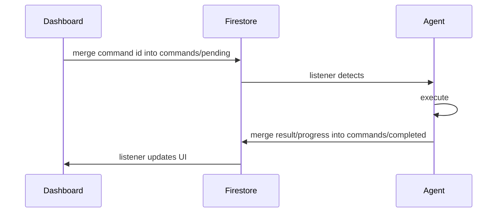

---

## command lifecycle



each machine has two command documents:

- `sites/{siteId}/machines/{machineId}/commands/pending`
- `sites/{siteId}/machines/{machineId}/commands/completed`

both documents store command IDs as top-level map fields. a successful terminal write removes the matching field from `pending`.

the same commands reach a machine on every platform; where one behaves differently, or not at all, on macOS or Linux, the tables below say so. the full per-platform picture is in [platform support](/docs/reference/platform-support).

---

## command types

### process management

| command | description | data payload |
|---------|-------------|--------------|
| `restart_process` | restart a configured process | `{process_name?, process_id?, processId?, timeout_seconds?}` |
| `start_process` | start a configured process | `{process_name?, process_id?, processId?}` |
| `stop_process` | stop a configured process | `{process_name?, process_id?, processId?}` |
| `kill_process` | terminate a process | `{process_name?, process_id?, processId?}` |
| `set_launch_mode` | set the launch mode (`off`, `always`, or `scheduled`) | `{process_name?, process_id?, processId?, mode, schedules?}` |
| `toggle_autolaunch` | legacy launch-mode toggle | `{process_name?, process_id?, processId?, autolaunch}` |

every process command matches `process_id` / `processId` first and falls back to `process_name`. `set_launch_mode` persists the requested `mode` and any supplied `schedules`.

for `restart_process`, `timeout_seconds` is the graceful-terminate window before the running process is force-killed: it defaults to 5 seconds, must be `>= 0`, and is capped at 30. `POST /api/sites/{siteId}/machines/{machineId}/commands` stamps its own top-level `timeout_seconds` (default 60, max 600) into every payload it queues, so an API-queued restart hits the 30-second cap unless the request body sends a smaller value — a `timeout_seconds` placed inside `params` is dropped by the route. restarting a process whose launch mode is `scheduled` outside its window records a manual override, the same as `start_process`.

### screenshots and live view

| command | description | data payload |
|---------|-------------|--------------|
| `capture_screenshot` | capture a desktop screenshot | `{monitor}` (0=all, 1=primary, etc.) |
| `start_live_view` | start a repeating screenshot loop | `{interval?, duration?}` |
| `stop_live_view` | stop the live-view loop | `{}` |

`capture_screenshot` uploads through the signed-URL flow. the capture happens inside the signed-in user's session: on Windows the service runs it there itself; on macOS the desktop app takes it, because the service has no display, and needs the app's Screen Recording grant. a Linux machine refuses the capture rather than answer with a black frame — there is no screen capture on Linux yet, though the dashboard menu still offers screenshot and live view.

`start_live_view` clamps `interval` to 5-60 seconds (default 10) and `duration` to 60-1800 seconds (default 600), then sets the machine's `liveView` flag until the duration expires or `stop_live_view` arrives. on a machine that can host [swoop](/docs/dashboard/swoop), the dashboard offers swoop in place of live view.

### configuration

| command | description | data payload |
|---------|-------------|--------------|
| `update_config` | update process configuration from the cloud | `{config}` |

### software deployment

| command | description | data payload |
|---------|-------------|--------------|
| `install_software` | download, checksum, and install software | `{installer_url, sha256_checksum, installer_name?, silent_flags?, verify_path?, timeout_seconds?, deployment_id?, parallel_install?, close_processes?, suppress_projects?}` |
| `cancel_installation` | cancel an in-progress installer process | `{installer_name}` |
| `uninstall_software` | run a software uninstaller | `{software_name, uninstall_command, silent_flags?, installer_type?, verify_paths?, timeout_seconds?, deployment_id?}` |
| `cancel_uninstall` | cancel an in-progress uninstall process | `{software_name}` |
| `refresh_software_inventory` | force an immediate installed-software inventory sync | `{}` |

remote installs run Windows installers. on macOS an application has no uninstaller to run, so `uninstall_software` quits the application and removes its bundle — only a bundle the machine's software inventory lists at that moment, and only under the Applications folders. whatever a package installed outside the bundle stays.

### project distribution

project distribution uses the roost handlers registered through the agent command router:

| command | description | data payload |
|---------|-------------|--------------|
| `sync_pull` | fetch a roost version manifest, download required chunks, and assemble files at the target root | `{site_id, roost_id, version_id, version_url, extract_root}` |
| `cancel_sync` | signal cancellation for an in-flight roost sync | `{site_id, roost_id, version_id}` |
| `rollback_to_version` | pull an older roost version after the server-side rollback pointer changes | `{site_id, roost_id, version_id, version_url, extract_root}` |

the legacy v1 ZIP commands (`distribute_project`, `cancel_distribution`) were removed — the roost commands above are the only distribution path.

### system commands

| command | description | data payload |
|---------|-------------|--------------|
| `reboot_machine` | reboot the machine after a 60-second OS countdown | `{}` |
| `shutdown_machine` | shut the machine down after a 60-second OS countdown | `{}` |
| `cancel_reboot` | abort a pending reboot or shutdown countdown | `{}` |
| `dismiss_reboot_pending` | clear the dashboard's reboot-pending state | `{process_name?}` |
| `update_owlette` | self-update the agent with the installer for its platform | `{installer_url, checksum_sha256, target_version?, deployment_id?}` |

the agent does not provide a remote self-uninstall command. remote software removal uses `uninstall_software` for third-party applications.

### display topology

| command | description | data payload |
|---------|-------------|--------------|
| `apply_display_topology` | validate and apply a monitor layout, then arm the auto-revert watchdog | `{layout, applyId}` |
| `ack_display_topology` | acknowledge an in-flight apply and cancel auto-revert | `{applyId}` |
| `enumerate_display_modes` | build and upload the supported display-mode catalogue | `{}` |
| `test_display_apply` | read-only helper smoke test — query plus validate against the live layout, never an apply | `{}` |

`apply_display_topology` and `ack_display_topology` also accept `apply_id` as an alias for `applyId`. the apply arms a 30-second revert watchdog: if no `ack_display_topology` carrying the same ID arrives before the deadline, the agent restores the previous configuration. `enumerate_display_modes` writes to `sites/{siteId}/machines/{machineId}/hardware/displayModes` and skips the upload when the topology signature matches the last successful one. see [displays](/docs/dashboard/displays).

### ai/hoot tools

| command | description | data payload |
|---------|-------------|--------------|
| `mcp_tool_call` | execute a hoot tool | `{tool_name, tool_params, chat_id?}` |
| `cancel_mcp_tool` | kill the process tree of an in-flight `mcp_tool_call` and mark it `cancelled` | `{target_command_id}` |
| `provision_cortex_key` | encrypt and store the local hoot provider key in the agent's `config.json` | `{api_key, provider?}` |

`cancel_mcp_tool` is handled inside the agent's Firestore client rather than the service dispatch chain, and runs on the fast command lane so it can interrupt the call it targets. cancelling is idempotent — an unknown or already-finished target returns a safe error. `provision_cortex_key` defaults `provider` to `anthropic`.

<Callout type="info" title={"hoot tool reference"}>

see the [hoot tools reference](/docs/reference/hoot-tools) for the canonical tool list with parameters, tiers, and allowed commands. some tools are Windows only, and say so there.

</Callout>

### swoop and site settings

the server queues these itself; nothing else should write them.

| command | description | data payload |
|---------|-------------|--------------|
| `swoop_session_requested` | a viewer has asked for a [swoop](/docs/dashboard/swoop) session; the agent starts the streamer for it, or attaches it to the one already running | `{sid}` |
| `swoop_kill` | end the named session, or whatever session is running when there is no `sid` | `{sid?}` |
| `swoop_refresh` | the site turned swoop on or off; the agent updates its standing connection to the signalling room | `{}` |
| `site_settings_refresh` | a site setting the agent mirrors changed — today the [keep screens awake](/docs/dashboard/getting-started#keep-screens-awake) switch; the agent reads its site's settings again | `{}` |

a swoop command carries a session ID and nothing else: the pending document is readable by every member of the site, so the session's keys and tokens never travel in it, and a swoop command with any other field is refused. all four run on the fast command lane, so a kill never waits behind an install.

---

## command document structure

### pending command

written as one field inside `sites/{siteId}/machines/{machineId}/commands/pending`:

```json
{
  "restart_process_machineA_1711234567890": {
    "type": "restart_process",
    "process_name": "TouchDesigner",
    "createdAt": "<server timestamp>",
    "expiresAt": "<timestamp>",
    "status": "pending"
  }
}
```

### completed command

merged into `sites/{siteId}/machines/{machineId}/commands/completed`, then removed from `pending`:

```json
{
  "restart_process_machineA_1711234567890": {
    "type": "restart_process",
    "result": "Process TouchDesigner restarted (PID 4242 → 12345)",
    "status": "completed",
    "completedAt": "<server timestamp>"
  }
}
```

### failed command

```json
{
  "restart_process_machineA_1711234567890": {
    "type": "restart_process",
    "error": "Error: relaunch of TouchDesigner returned no PID",
    "status": "failed",
    "completedAt": "<server timestamp>"
  }
}
```

a record is written as `failed` only when the agent's result string starts with `Error:` — the agent's Firestore client decides completed-vs-failed on that prefix alone. naming a process that is not in the machine's configuration is not an `Error:` string, so `restart_process`, `start_process`, `stop_process`, `kill_process`, `set_launch_mode`, and `toggle_autolaunch` all record `status: "completed"` with `result: "Process <name> not found in configuration"`. consumers must inspect `result`, not `status` alone, to detect a bad process name. genuine `restart_process` failures read `Error: invalid timeout_seconds value: ...`, `Error: timeout_seconds must be >= 0 ...`, `Error: failed to stop <name>: ...`, `Error: failed to relaunch <name>: ...`, or `Error: relaunch of <name> returned no PID`.

progress updates are also merged into the completed document under the same command ID with fields such as `status`, `progress`, `deployment_id`, and `updatedAt`. terminal states include `completed`, `failed`, and `cancelled`.

---

## command polling (dashboard)

when the web API queues a command, `POST /api/sites/{siteId}/machines/{machineId}/commands` accepts `type`, `params`, and optional `timeout_seconds`, then returns `202` with `{commandId, status: "pending"}`.

poll `GET /api/sites/{siteId}/machines/{machineId}/commands/{commandId}` for the command result. the status route returns `pending`, `in_progress`, `completed`, `failed`, or a 404/timeout. hoot tool execution polls completion internally about every 1.5 seconds.

---

## software installation flow

the `install_software` command triggers a multi-step process:

```
1. download the installer to the agent's temp installer directory.
   progress: downloading 0% to 100%

2. verify sha256_checksum.
   missing or mismatched checksums fail the command before execution.

3. optionally stop conflicting processes and suppress managed projects.
   controlled by close_processes and suppress_projects.

4. run the installer with its silent flags in the interactive user's session.
   progress: installing, then waiting for the exit code.

5. verify the installation if verify_path is provided or derived from /DIR.

6. clean up the temp file, release install locks, and sync the software inventory.
```

### install_software payload

| field | required | default | notes |
|-------|----------|---------|-------|
| `installer_url` | yes | none | URL downloaded by the agent. |
| `sha256_checksum` | yes | none | the command is refused without this checksum. |
| `installer_name` | no | `installer.exe` | used for the temp filename and process tracking. |
| `silent_flags` | no | empty string | passed to the installer. `/DIR=...` can auto-fill `verify_path`. |
| `verify_path` | no | auto-derived from `/DIR` when possible | checked after installer success. |
| `timeout_seconds` | no | `2400` | installer timeout in seconds. |
| `deployment_id` | no | none | included in progress records. |
| `parallel_install` | no | `false` | temporarily hides matching registry keys during install. |
| `close_processes` | no | `[]` | process names to terminate before install. |
| `suppress_projects` | no | `[]` | managed project IDs to lock during install. |

### supported installer types

| type | silent flag | example |
|------|-------------|---------|
| **Inno Setup** | `/VERYSILENT /SUPPRESSMSGBOXES` | owlette itself on Windows |
| **NSIS** | `/S` | Notepad++ |
| **MSI** | `msiexec /i installer.msi /qn` | Windows Installer packages |
| **custom** | varies | any executable with silent flags |

---

## project distribution flow

### roost v2 sync

the `sync_pull` command is the current distribution path:

```
1. validate the required site, roost, version, URL, and target-root fields.
2. check the site-level roost kill switch.
3. validate extract_root against the agent's destination allowlist.
   a path outside the allowed roots is refused here, before any download —
   the target state goes straight to failed with "destination refused".
4. report the target state as pending.
5. mint a fresh version download URL when the Firebase client can do so.
6. fetch and validate the version manifest.
7. diff against the most recent local committed version for that roost.
8. register or resume a local distribution row.
9. download missing chunks with throttled progress updates.
10. assemble files atomically into extract_root.
11. commit the distribution and report the final target state.
```

`cancel_sync` looks up the matching in-flight distribution by `site_id`, `roost_id`, and `version_id`, then signals its cancellation event. `rollback_to_version` reuses the same `sync_pull` path; the server-side roost rollback has already selected the older version. see [roost](/docs/dashboard/roost).

---

## system command details

### reboot / shutdown

manual reboot and shutdown commands do not accept configurable countdown fields. the agent records the shutdown intent locally, announces the countdown to Firestore so the dashboard can show it, then asks the OS for a fixed 60-second countdown:

| platform | reboot | shutdown | cancel |
|----------|--------|----------|--------|
| Windows | `shutdown /r /t 60 /c "owlette remote reboot requested"` | `shutdown /s /t 60 /c "owlette remote shutdown requested"` | `shutdown /a` |
| macOS | `/sbin/shutdown -r +1 "owlette remote reboot requested"` | `/sbin/shutdown -h +1 "owlette remote shutdown requested"` | the agent ends the pending shutdown's own process — BSD `shutdown` has no cancel flag |
| Linux | `shutdown -r +1 "owlette remote reboot requested"` | `shutdown -h +1 "owlette remote shutdown requested"` | `shutdown -c` |

macOS and Linux count in whole minutes, so a delay is rounded up and never rests below one minute — which is what keeps a scheduled reboot cancellable. `cancel_reboot` aborts the pending countdown and clears the dashboard flags when Firestore is available.

### self-update

`update_owlette` requires `installer_url` and `checksum_sha256`. the agent derives `target_version` from the payload or URL, downloads the installer into a staging folder only the service can write, checks that it is this platform's installer and matches the checksum, writes an update marker, and hands the install to the OS so it outlives the service: a one-time scheduled task running as `SYSTEM` on Windows (with a recovery task that restarts the service if it does not come back), a run-once launchd job on macOS, and a transient systemd unit running `apt-get` on Linux. see [self-update](/docs/agent/self-update).
