---

## system overview

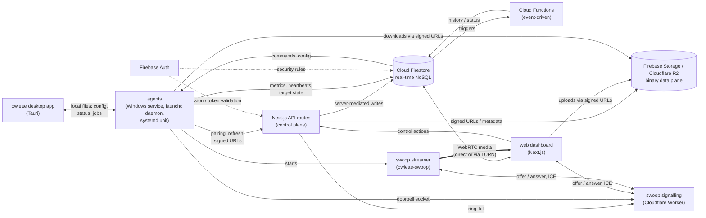

---

## components

### the agent

the agent is a Python 3.11 service that ships with its own interpreter. the same code and the same 5-second main loop run on all three platforms; each one hosts it with its own service manager:

| platform | hosted as | runs | data root |
|---|---|---|---|
| Windows | the `OwletteService` Windows service, whose image is **owlette-host** (`tools\owlette-host.exe`), a small Rust supervisor that replaced NSSM in 3.0.0 | `python\python.exe agent\src\owlette_runner.py` | `C:\ProgramData\Owlette` |
| macOS | the launchd daemon `app.owlette.agent` (`/Library/LaunchDaemons/app.owlette.agent.plist`), started at boot and kept alive | `runtime/python/bin/python3 runtime/agent/src/owlette_runner.py` | `/Library/Application Support/Owlette` |
| Linux | the systemd unit `owlette-agent.service` | `/opt/owlette/python/bin/python3 /opt/owlette/agent/src/owlette_runner.py` | `/var/lib/owlette` |

on every platform the agent:

- **monitors processes** every 5 seconds: detects crashes, stalls and exits
- **restarts** crashed applications in the logged-in user's session: with `CreateProcessAsUser` on Windows, as a launchd job in the user's GUI session on macOS, and as the console user with the graphical session's environment on Linux
- **sends heartbeats and metrics** (CPU, memory, disk, GPU, network) at an adaptive interval: 5 seconds while the desktop app's window is open, 30 while processes are running, 120 when idle
- **executes commands** from the dashboard: restart a process, install software, reboot and the rest
- **syncs configuration** both ways between the desktop app and the cloud
- **keeps working offline**: it goes on monitoring without internet and syncs when it reconnects

a few features are Windows-only: window visibility and process priority, hang detection, [display layout management](#display-layout-management-windows) and per-volume disk activity, which comes from Windows performance counters.

the agent talks to Firestore through a **custom REST client**, not the Firebase Admin SDK, and authenticates with a two-token OAuth scheme; see [two Firebase clients](#two-firebase-clients).

**owlette-host on Windows.** the Service Control Manager starts owlette-host, which launches the bundled interpreter on `owlette_runner.py` with no console window, pumps the agent's stdout and stderr into `service_stdout.log` / `service_stderr.log` (10 MiB each, with a single `.1` rotation sibling), and records its own spawns, exit codes, stops and backoff in `service_host.log`.

its restart policy: exit 42 (restart flag) and exit 43 (self-restart watchdog) relaunch at once, exit 0 is a clean exit that stops the service, and any other code is a crash that relaunches after 5 seconds, backing off to 60 once five exits land inside 5 minutes. on a stop the host reports `STOP_PENDING` to the SCM; the agent polls that state every 250 ms and answers by flushing `online: false`. only after a 20-second grace window does the host terminate, and it terminates **only the process it launched**, never the process tree, so managed applications and the desktop app survive a service restart. `owlette-host install` is also the migration path: it stops and removes any existing registration, an NSSM one included, before registering its own.

on macOS and Linux, launchd and systemd do the same job: each restarts the agent 5 seconds after it exits, and the Linux unit stops only the agent's own process (`KillMode=process`).

<Callout type="info" title={"key directories"}>

| | Windows | macOS | Linux |
|---|---|---|---|
| agent code | `C:\ProgramData\Owlette\agent\src\` | `/Library/Application Support/Owlette/runtime/agent/src/` | `/opt/owlette/agent/src/` |
| config | `C:\ProgramData\Owlette\config\config.json` | `/Library/Application Support/Owlette/config/config.json` | `/var/lib/owlette/config/config.json` |
| logs | `C:\ProgramData\Owlette\logs\` | `/Library/Application Support/Owlette/logs/` | `/var/lib/owlette/logs/` |

</Callout>

### the desktop app

the owlette desktop app is a Tauri 2 app (Rust, with React in the system's webview): the tray or menu bar icon, the process and configuration editor, service state, pairing and leaving a site, bug reports and the reboot prompt. on macOS it also reports the app's Screen Recording and Accessibility grants.

| platform | binary | started by |
|---|---|---|
| Windows | `C:\ProgramData\Owlette\app\owlette-desktop.exe` | the service, in the logged-in user's session, and a login item |
| macOS | `/Applications/owlette.app` | the LaunchAgent `app.owlette.desktop`, at every login |
| Linux | `/usr/bin/owlette-desktop` | the systemd user unit `owlette-desktop.service` |

the app and the agent never open a network connection to each other. they share files under the data root: `config.json`, and the status files in `tmp/` that the agent writes and the app watches, written under the same lock and atomic rename on both sides. on Windows the app controls the service through the SCM. on macOS and Linux, where the agent runs as root with no display, two more directories carry requests: `ipc/requests/` for privileged actions (pair, leave, restart, reboot, report), and `ipc/jobs/` for work only a process in the user's session can do, such as a screenshot, a notification or starting the swoop streamer.

### web dashboard (Next.js)

the dashboard is a Next.js 16 application on Railway, with a failover origin behind a Cloudflare load balancer. it:

- **displays real-time data** through Firestore `onSnapshot` listeners
- **manages processes**: add, edit, remove, start, stop, kill
- **deploys software**: pushes installers to machines with progress tracking
- **publishes roost versions**: content-addressed project sync through R2 chunks, immutable version history, resync and rollback
- **manages access**: per-site roles and capabilities; see the [admin panel](/docs/dashboard/admin)
- **runs swoop sessions**: the viewer, and the routes that authorise and lease each session
- **provides hoot**: an AI chat for machine interaction, plus autonomous crash investigation

### Firebase backend

Firebase provides the shared platform services:

- **Cloud Firestore**: real-time state, command queues, machine metrics, roost pointers and site data
- **Firebase Authentication**: user sign-in (email and password, Google OAuth) and agent identity (custom tokens). passkeys and authenticator codes are verified by the web server
- **Firebase Storage**: installer binaries, screenshot objects and other Firebase-backed downloads
- **Cloud Functions (2nd gen)**: Firestore-triggered and scheduled server-side jobs (below)

the dashboard's Next.js API routes handle most control-plane work: session creation, agent pairing and refresh, server-mediated writes, the public API, email and signed URL issuance. Cloud Functions handle what must run in response to a Firestore write or on a schedule.

### cloud functions

Cloud Functions run on Firebase (2nd gen, Node.js 22). the exported inventory is defined in `functions/src/index.ts` and grouped by purpose below.

| function | trigger | purpose |
|----------|---------|---------|
| **onMetricsWrite** | Firestore `onDocumentWritten` on `sites/{siteId}/machines/{machineId}` | appends a compact sample to the daily `metrics_history/{YYYY-MM-DD}` bucket (per-CPU, per-disk usage, per-volume disk IO, per-GPU, per-NIC). also evaluates threshold alert rules and fires notifications when breached. rate-limited to one sample per 55 seconds. each numeric field is `Number.isFinite()`-guarded so a single poisoned reading can't reject the whole sample write. |
| **onCommandCompleted** | Firestore `onDocumentWritten` on `sites/{siteId}/machines/{machineId}/commands/completed` | when an agent finishes a command with a `deployment_id`, updates the deployment target's status, progress and timestamps, and recalculates the deployment's overall status across all targets. |
| **sweepStaleDeployments** | Cloud Scheduler, every 5 minutes | catches deployments stuck in non-terminal states (agent crash, network loss). marks pending targets failed after 15 minutes, downloading or installing targets after 30. |
| **sweepScheduledRollouts** | Cloud Scheduler, every 5 minutes | fires the roost rollouts a deploy parked at `stage: 'scheduled'` once their `scheduleAt` comes due, entering the same canary pipeline an immediate deploy does. a rollout too far past its slot is aborted rather than fired. |
| **onRoostWritten** | Firestore `onDocumentWritten` on `sites/{siteId}/roosts/{roostId}` | roost fan-out. detects a `currentVersionId` change, partitions targets into canary and fleet cohorts (stable hash, &lt;=10% / cap 50 canary), creates the rollout state doc and dispatches canary `sync_pull` commands. |
| **onTargetStateWritten** | Firestore `onDocumentWritten` on `sites/{siteId}/roosts/{roostId}/target_state/{machineId}` | roost rollout state machine. transactional canary→fleet promotion on ≥90% success, abort on >25% failure (mid-wave, not waiting for full settlement). |
| **verifyChunk** | HTTPS request | roost integrity check. streams an R2 chunk, computes SHA-256, deletes and alerts on a hash mismatch (planted-bytes defense). invoked through a Cloudflare Worker webhook on every R2 PUT. |
| **chunkGcNightly** | Cloud Scheduler, 02:15 UTC | roost chunk garbage collection. two-phase mark-and-sweep with a 30-day tombstone TTL, a resurrection guard (a chunk re-referenced between mark and sweep has its tombstone cleared) and pause-during-publish. `CHUNK_GC_MODE=dry-run` by default. |
| **preUploadCheck** + **reconcileQuota** | HTTPS + Cloud Scheduler (03:45 UTC) | roost per-tenant quota. pre-upload admit reserves pending bytes atomically; the daily reconcile re-reads authoritative usage and fires only newly crossed 50/80/100% alarms. |
| **aggregateTelemetry** + **recordUsageEvent** + **getUsageSummaryHttp** | Cloud Scheduler (04:30 UTC) + HTTPS | roost telemetry. per-tenant cost attribution against R2 pricing ($0.015/GB-month, $4.50/M class-A, $0.36/M class-B, $0 egress). OTLP-shaped structured logs for a downstream collector. |
| **recordAuditEvent** + **exportAuditDaily** + **verifyAuditChain** | HTTPS + Cloud Scheduler (05:15 UTC) | roost append-only audit log. SHA-256 hash-chained records (tamper-evident against deletion and mutation), 7-year retention, BigQuery cold-storage sink at 05:15 UTC. |
| **exportSecurityBoundaryAuditDevDaily** | Cloud Scheduler, 06:30 UTC | exports security-boundary audit collections to the configured GCS audit bucket. |
| **emitWebhook** + **processRetryQueue** | HTTPS + Cloud Scheduler (every minute) | roost webhook dispatcher. 7 event types (`distribution.queued/started/succeeded/failed`, `chunk.uploaded`, `manifest.published`, `rollback.executed`), HMAC-SHA256 signed (`sha256=<hex>`), exponential backoff retry (5 s base × 3 × 1 h cap × ±20% jitter, 10-attempt cap). |
| **sweepExpiredApiKeysDaily** | Cloud Scheduler, 03:00 UTC | marks expired user API keys so settings and API auth stop treating them as active. |
| **sweepExpiredIdempotencyCacheDaily** | Cloud Scheduler, 03:30 UTC | removes expired idempotency cache entries from `idempotency_cache/{hash}`. |
| **onTalonLogEventCreated** | Firestore `onDocumentCreated` on `sites/{siteId}/logs/{logId}` | forwards `process_restarted` and the `display_*` events, which agents write straight into the site log, to the talon matcher, so talons can fire on them. |

**deployment:**

```bash
# deploy all functions
cd functions && firebase deploy --only functions

# deploy a single function
firebase deploy --only functions:onMetricsWrite

# check which project is active
firebase use
# dev: owlette-dev-3838a | prod: owlette-prod-XXXXX
```

**environment:** `functions/.env` holds `CORTEX_INTERNAL_SECRET` (the shared secret for internal API auth, which must match the web app's). `API_BASE_URL` is derived from the Firebase project ID.

---

## swoop (remote desktop)

[swoop](/docs/dashboard/swoop) streams a machine's screen to a browser, or to [owlette swoop](/docs/dashboard/swoop#owlette-swoop), the desktop viewer app that shows the same viewer page, and carries keyboard, mouse, clipboard and audio. the web app authorises each session; it never carries the media.

### its parts

| part | where | what it does |
|---|---|---|
| **streamer** | `agent/swoop`, the Rust binary `owlette-swoop` | captures the screen, encodes it, speaks WebRTC (str0m) to each browser, plays back input and syncs the clipboard. its version must equal the agent's, or the agent will not start it |
| **signalling worker** | `infra/swoop-signal`, a Cloudflare Worker with one Durable Object room per machine | relays the WebRTC offer, answer and ICE candidates between a browser and the streamer, holds each agent's idle doorbell socket, and broadcasts kills. it verifies tokens with the public key only, and never sees media |
| **session routes** | `/api/sites/{siteId}/machines/{machineId}/swoop/*` | start a session, renew its lease, end it and kill it. they apply the site's policy, the step-up, and the audit trail |
| **agent routes** | `/api/agent/swoop/bundle`, `/doorbell-token`, `/events` | hand the agent a session's bundle and its doorbell token, and take the streamer's audit events |
| **STUN / TURN** | Cloudflare | STUN (`stun.cloudflare.com:3478`) lets each end learn its public address; Cloudflare Realtime TURN relays when no direct path exists. the API mints TURN credentials per session, for each end |

capture and encoding differ by platform:

| platform | capture | encode | started |
|---|---|---|---|
| Windows | DXGI desktop duplication | NVENC (H.264 or HEVC) | by the service, with its own SYSTEM token placed in the console session: that is what lets it see and drive UAC prompts and the lock and sign-in screens |
| macOS | ScreenCaptureKit | VideoToolbox (H.264 or HEVC) | by the desktop app, at the agent's request, as the app's own child, so it runs under the app's Screen Recording and Accessibility grants. the session bundle travels over a unix socket, never a file |
| Linux | none yet | none | not shipped: the Linux package carries no streamer, so the agent reports `capabilities.swoop: 0` |

### a session, start to finish

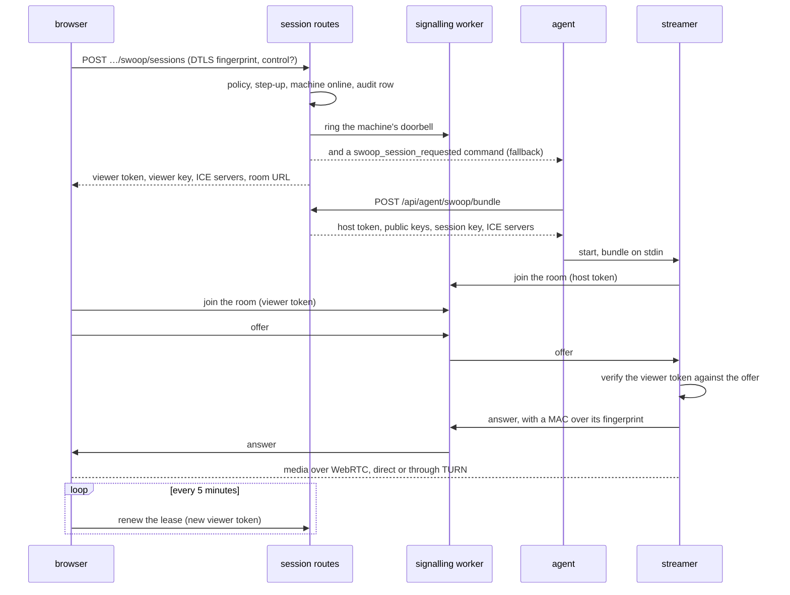

### tokens and keys

- **three signed tokens**, all EdDSA (ed25519) and signed by the API: a **viewer** token (60 seconds, bound to the browser's DTLS fingerprint and to control or watch), a **host** token for the streamer (300 seconds) and a **doorbell** token for the agent's idle socket (300 seconds). the worker and the streamer hold only the public key
- **the lease** is 5 minutes. each renewal re-checks the policy and hands the browser a fresh viewer token, which it passes to the streamer; a viewer whose lease lapses is dropped after a 30-second grace
- **the session key**: the API derives one per session from `SWOOP_SESSION_MASTER_KEY` and gives it only to the streamer, and derives each viewer's key from it. the streamer MACs its DTLS fingerprint with the viewer's key in its answer, so a browser can tell if anything between them swapped the fingerprint. media itself is ordinary DTLS-SRTP, end to end

the variables behind all this are in [environment variables](/docs/setup/environment-variables#swoop-required-for-remote-desktop).

---

## data flow

### heartbeat & metrics

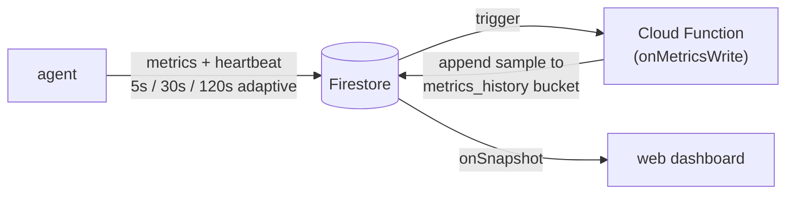

### command execution

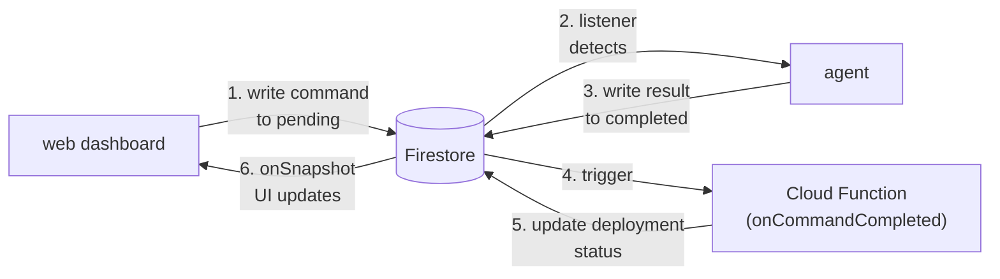

### configuration sync

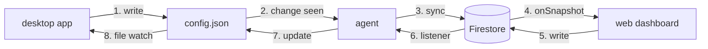

### per-volume disk IO (Windows)

the disk subsystem reports two independent axes per logical volume, kept distinct in both the data path and the dashboard:

- **storage**: capacity used, from `psutil.disk_usage()`. slow-moving, near 100% on long-running machines
- **activity**: read and write throughput as a percentage of the volume's maximum bandwidth, from WMI's `Win32_PerfFormattedData_PerfDisk_LogicalDisk`. spiky, near zero most of the time

each volume's `maxBps` is set at first call by querying `MSFT_PhysicalDisk` for its hardware class (NVMe ≈ 3.5 GB/s, SATA SSD ≈ 550 MB/s, HDD ≈ 150 MB/s, and so on) and ratcheted up by observed peaks; without it the chart's Y axis would have no meaningful ceiling.

two operational quirks shape the implementation:

1. **WMI watchdog (10 s).** the perflib `LogicalDisk` provider stalls for several seconds when the BITS service changes state during Windows Update / Delivery Optimization polling. a 2 s or 5 s budget reproducibly skipped these stalls (about 3.6 timeouts an hour); 10 s captures them with zero observed timeouts. the disk IO collector runs on its own thread, so the worst-case wait never blocks the main metrics loop. (a persistent-WMI-worker variant was tried first but triggered `RPC_E_WRONG_THREAD` on every call after the first: the Python `wmi` package binds proxies to the apartment that created them, which rules out reusing a cached proxy from a long-lived thread. the per-call pattern stays.)
2. **volume filter.** raw `HarddiskVolumeN` partitions with no drive letter are dropped at the agent before they reach Firestore, so the dashboard lists only drive letters people recognise.

`onMetricsWrite` flattens per-volume readings into history samples under `sample.dios = [{i, rb, wb, mb}]`: volume ID, read bytes/s, write bytes/s and the `maxBps` in effect at that moment, kept per sample so historical scaling stays correct after the ratchet has moved.

---

## two Firebase clients

this is the most important architectural distinction:

| | web dashboard | Python agent |
|---|---|---|
| **SDK** | Firebase client SDK (`firebase/firestore`) | custom REST client (`firestore_rest_client.py`) |
| **auth** | Firebase Auth (email/password, Google OAuth) | OAuth two-token system (custom token + refresh token) |
| **real-time** | `onSnapshot` listeners | polling + Firestore listener thread |
| **timestamps** | `serverTimestamp()` | REST API `timestampValue` format |

the agent does **not** use the Firebase Admin SDK or any official Firebase Python library. it uses a hand-built client for the Firestore v1 REST API, which keeps the agent light and avoids the heavy `google-cloud-firestore` dependency.

---

## authentication architecture

### user authentication

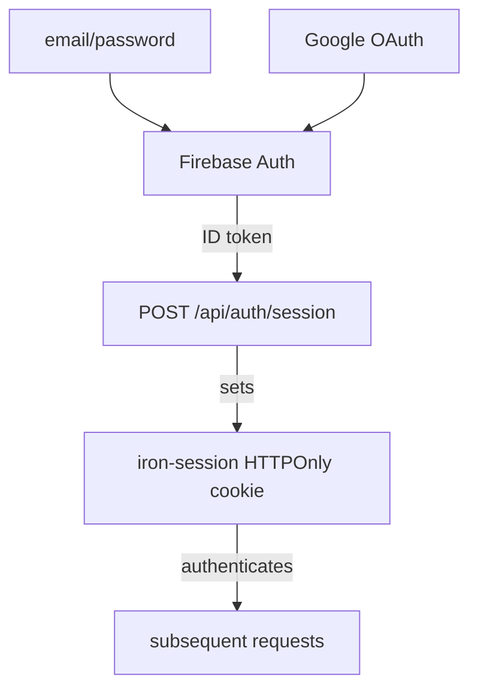

### agent authentication (OAuth)

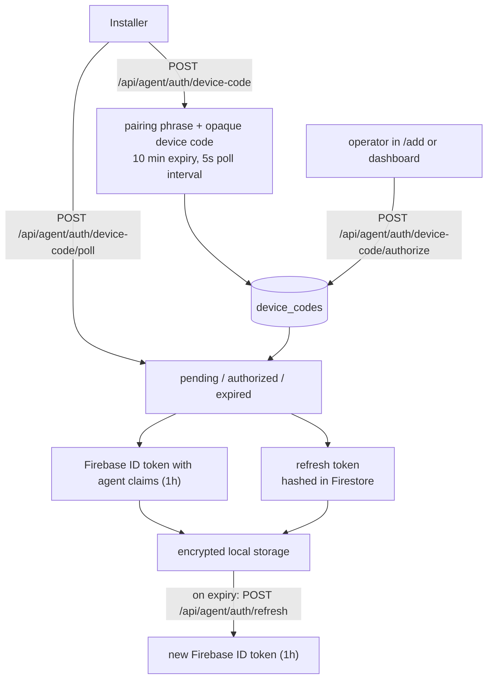

<Callout type="info" title={"more details"}>

see the [authentication reference](/docs/reference/authentication) for the complete flow, MFA included.

</Callout>

---

## security model

### site-based access control

all data is scoped to **sites**, and what a person may do on a site is decided by their role on that site, held in `sites/{siteId}/members/{uid}`. their account-level role grants nothing on a site.

| who | access |
|------|--------|
| **member** | read access to the site: machines, screenshots, live view, watching swoop |
| **admin** | a member's access plus writes: commands, configuration, deployments, roosts, swoop control and settings, membership |
| **owner** | an admin's access plus deleting the site and transferring ownership. one per site |
| **superadmin** | every site and the platform-level operations, without member rows |
| **agent** | a single site and a single machine, from its token's claims |

the full capability list is in the [admin panel](/docs/dashboard/admin#capability-matrix).

### Firestore security rules

rules enforce access at the database level, so no client can bypass them:

- users must be authenticated, and a deleted user is refused immediately
- site access is checked through `canAccessSite(siteId)`: a superadmin, or an active member row for that site
- site-level elevated operations are checked through `isSiteAdmin(siteId)`: an owner or admin member row, or a superadmin
- platform-wide operations are checked through `isSuperadmin()`
- agents are scoped by the `site_id` and `machine_id` claims in their custom token, through `agentCanAccessMachine(siteId, machineId)`
- the token collections (`agent_tokens`, `agent_refresh_tokens`) are server-side only

---

## offline resilience

the agent is designed to operate without internet:

1. **no connection**: the agent uses its last cached `config.json` and keeps monitoring processes locally
2. **connection restored**: the agent reconnects through `ConnectionManager`, with exponential backoff
3. **metrics resume**: heartbeats and metrics resume as soon as it reconnects
4. **commands queued**: pending commands in Firestore are picked up when the agent comes back online

`ConnectionManager` is a state machine with circuit-breaker logic. retry backoff starts at 30 seconds, doubles with jitter and caps at 1 hour. after enough consecutive failures the circuit opens; the first recovery probe is allowed after 5 minutes, while near-fatal configuration errors keep retrying on the 1-hour cadence.

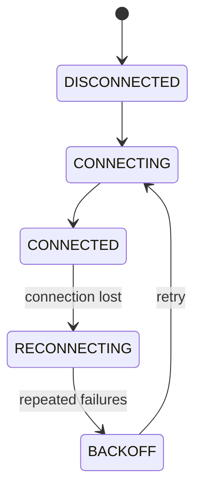

---

## display layout management (Windows)

owlette tracks each machine's monitor topology end to end: the agent enumerates the live configuration through the Windows CCD API, an operator can capture the current arrangement as the "stored" layout, and a recall command pushes the stored layout back when monitors drift. the dashboard panel edits stored layouts in place, and an opt-in auto-restore reapplies the stored layout on detected drift. this part of the agent exists on Windows only.

### data model (machine-scoped)

| Firestore path | owner | purpose |
|---|---|---|
| `sites/{siteId}/machines/{machineId}/hardware/display` | agent | live topology snapshot, refreshed every 5 minutes and on topology-change events |
| `sites/{siteId}/machines/{machineId}/hardware/displayModes` | agent | per-`edidHash` catalogue of supported modes. on demand: the dashboard fires `enumerate_display_modes` when the editor opens, and the agent skips the upload if `signatureHash` is unchanged |
| `config/{siteId}/machines/{machineId}` (`displays.assigned`) | operator | the stored layout: `{monitors: MonitorInfo[], capturedAt, capturedBy}` |
| `config/{siteId}/machines/{machineId}` (`displays.autoRestore`) | mixed | `{enabled, enabledBy, enabledAt}` set by the operator; `circuitBreaker.{tripped, failures, lastError, lastSuccessAt, lastFailureAt, trippedAt}` set by the agent (an operator can reset `tripped: false` + `failures: 0`) |
| `sites/{siteId}/logs` (`action.startsWith('display_')`) | agent | event audit log; each entry has `{action, level, machineId, details (json)}` |
| `pending_display_alerts/*` | web (`/api/agent/alert`) → cron | digest queue for display alerts off the critical path |

### event taxonomy

10 audit-log actions are emitted from `_emit_display_change_events` (in `agent/src/owlette_service.py`):

| event | trigger | severity |
|---|---|---|
| `display_monitor_added` | new edidHash in live, not in prev | info |
| `display_monitor_removed` | prev edidHash gone from live | critical |
| `display_monitor_swapped` | same `targetId` reports a different `edidHash` | warning |
| `display_drift` | same `edidHash`, one or more tracked fields (position, resolution, refreshHz, rotation, scalePct, primary) changed | warning |
| `display_mosaic_disabled` | NVIDIA Mosaic was active in prev, not in current | warning |
| `display_sync_lost` | a G-Sync / framelock device that was `locked` in prev is no longer locked | warning |
| `display_apply_succeeded` | recall finished cleanly | info |
| `display_apply_failed` | sdc_validate or sdc_apply rejected | critical |
| `display_apply_refused_mosaic` | recall blocked because Mosaic is active | warning |
| `display_auto_revert_fired` | the watchdog reverted a recall (no operator ack within 30 s) | critical |

the routing table at `web/lib/alerts/displayEventRouting.ts` is the single source of truth for which channel each event ships to (email, webhook, dashboard only); see the changelog for the severity decisions.

### post-apply suppression window

the agent stamps `_last_apply_finished_at = time.time()` at the end of every successful apply, manual or auto-restore. when `_emit_display_change_events` runs within 90 seconds of that timestamp, every event payload gets `suppressAlert: true` + `correlatedApplyId: <the apply's uuid>`. the `/api/agent/alert` route honours the flag: it skips the email digest queue and still fires the webhook (receivers handle their own dedup). this stops the recall-then-N-drift-emails avalanche, where a successful 8-monitor recall would otherwise emit 8 separate `display_drift` events as the OS settled.

### auto-restore: gate chain

`_maybe_auto_restore(new_profile)` runs the 7-gate chain in order. the first failure exits early; only when all 7 pass does it spawn `_run_auto_restore` on a daemon thread.

```
1. displays.enabled            (kill switch — operator-set; missing = enabled)
2. displays.autoRestore.enabled (per-machine opt-in — default false)
3. circuitBreaker.tripped       (false required)
4. _apply_in_flight             (false required — no concurrent manual apply)
5. drift fixable                (every drifted edidHash present in assigned.monitors)
                                — else: emit display_auto_restore_skipped_unfixable, return
6. _drift_pending_tick_count    (>= 2 — drift persisted across two 30s topology checks ≈ 60s)
7. apply cooldown               (time.time() - _last_apply_time >= _APPLY_COOLDOWN_SECONDS)
```

gates 1 to 3 short-circuit silently: the operator already knows their config, so no audit is needed. gate 5 emits the `display_auto_restore_skipped_unfixable` audit so the operator sees why the auto-fix did not fire when a new monitor was plugged in. gates 4, 6 and 7 are silent; the next topology check retries.

### auto-restore: fixability model

only `display_drift` events trigger auto-restore. the other monitor-change events (`_added`, `_removed`, `_swapped`) are deliberately NOT wired into `_maybe_auto_restore`, because they describe drift that re-applying the stored layout *cannot fix*:

- **`_monitor_added`**: a new physical panel is in live but not in assigned. re-applying assigned changes nothing because the new monitor is not referenced, and looping would trip the auto-restore cooldown forever with no change
- **`_monitor_removed`**: the assigned monitor is unplugged. Windows cannot apply a config that references an absent panel; SDC_VALIDATE would reject it, and looping would burn the breaker on guaranteed failures
- **`_monitor_swapped`**: the same `targetId` now reports a different `edidHash`. the stored layout does not reference the new edidHash, so the apply is unfixable in the same way as `_removed`

for all three the operator gets the audit event in the dashboard's events tab and, per the routing table, a webhook delivery, but no auto-restore attempt and no breaker increment.

### auto-restore: circuit breaker

`_run_auto_restore` writes the breaker state to `config/{siteId}/machines/{machineId}.displays.autoRestore.circuitBreaker` after each attempt:

- **success** → `{failures: 0, tripped: false, lastSuccessAt: <iso8601>}`
- **rate-limited** (`AUTO_RESTORE_RATE_LIMITED`) → no-op (skipped on purpose, not a real failure)
- **unfixable** (`AUTO_RESTORE_SKIPPED_UNFIXABLE`) → no-op (same)
- **other failure** → `{failures: <prev + 1>, lastFailureAt: <iso8601>, lastError: <truncated to 500 chars>}`. at `failures >= 3` it also sets `{tripped: true, trippedAt: <iso8601>}` and emits the `display_auto_restore_circuit_breaker_tripped` audit at error severity

while `tripped: true`, gate 3 short-circuits later `_maybe_auto_restore` calls: no thread is spawned and no further failures are counted. the dashboard panel's red banner offers a one-click reset (`tripped: false, failures: 0`); the next drift event after a reset goes through the gate chain normally.

### state-machine reference

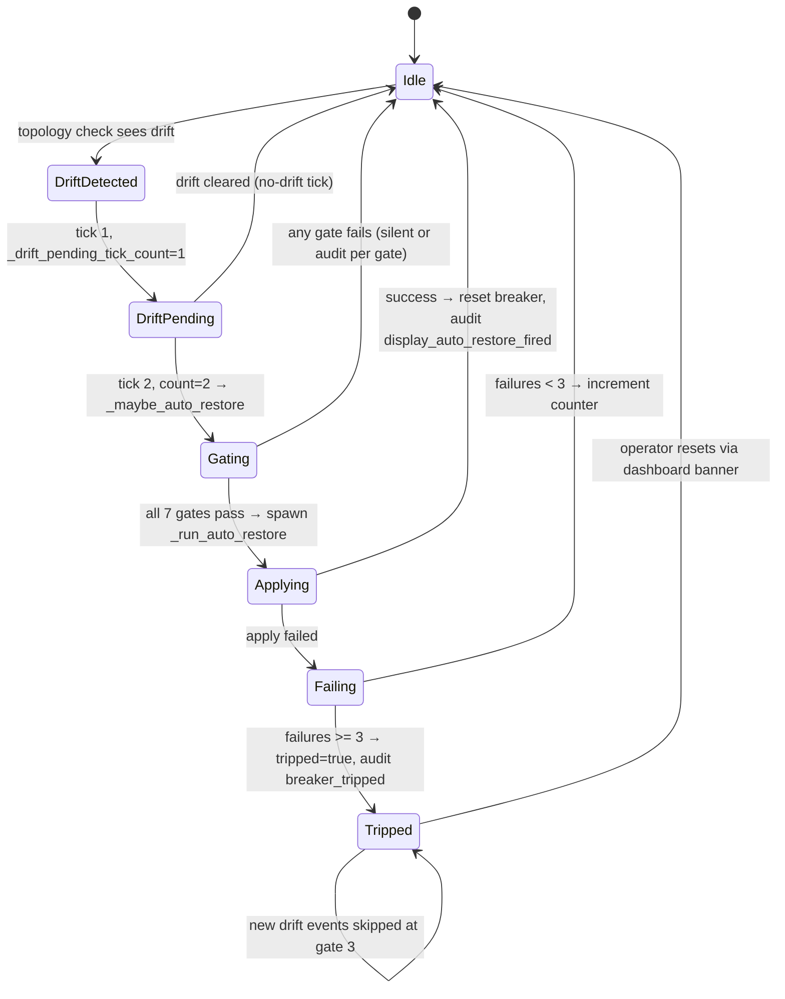

### in-process / Firestore boundaries

module state held by `display_manager.py`: `_apply_in_flight`, `_apply_lock`, `_current_apply_id`, `_last_apply_time`, `_last_apply_finished_at`, `_ack_event`. these coordinate the apply path and the suppression window across threads but never touch Firestore directly; Firestore writes go through `firebase_client` helpers (`_ensure_display_profile`, `_ensure_display_modes_catalogue`, `update_display_autorestore_state`, `log_event`). service-class state held by `OwletteService`: `_drift_pending_tick_count`, the per-tick counter for the persistence gate. `OwletteService._init_state()` is the one place instance attributes are initialised, so a startup under owlette-host, which builds the service through that method, cannot crash on a missing field.

---

## roost: content-addressed project distribution (v2)

roost replaces v1's single-URL-per-distribution model with a content-addressed sync layer. a synced folder maps to an immutable sequence of versions; flipping a roost's `currentVersionId` pointer is what triggers a deploy or a rollback.

### why the model changed

v1 distribution was a one-shot download of a ZIP from a host-supplied URL. a one-byte change re-uploaded the whole archive, there was no rollback, and agents re-verified by downloading again. roost fixes all three: content-addressed dedup transfers only changed bytes, rollback is an atomic pointer flip, and the version body is authoritative (chunks are validated by hash, with no separate verify-files list).

### storage layout

chunks are stored in **Cloudflare R2** under a per-tenant prefix:

```
project-content/{siteId}/{hash[0:2]}/{hash}
```

- `siteId` scopes each customer, preventing cross-tenant access by guessing signed URLs
- `hash[0:2]` shards within a tenant so R2 listings don't bottleneck on a single prefix
- `hash` is the lowercase 64-character SHA-256 of the 4 MiB chunk

version bodies are stored at `project-manifests/{siteId}/{roostId}/{versionId}.json` (the R2 prefix keeps its legacy name) and are immutable once written. a Firestore pointer at `sites/{siteId}/roosts/{roostId}.currentVersionId` is the mutable head; `versionUrl` points at the current version body object.

### version body format

the version body is an OCI-derived JSON document with media type `application/vnd.owlette.version.v1+json`. it is canonical JSON with a `config` object and a non-empty `files[]` array. `config` is free-form provenance about the push: the server checks only that it is an object and stores it verbatim, so it can later answer "how was this version produced?". the keys below are what `owlette push` emits (`cli/src/lib/versionBuilder.ts`); `hostname` and `platform` are left out when the CLI can't determine them. minimal shape:

```json
{
  "schemaVersion": 2,
  "mediaType": "application/vnd.owlette.version.v1+json",
  "config": { "producer": "owlette-cli", "cliVersion": "1.0.0-rc.0", "hostname": "studio-01", "platform": "win32" },
  "files": [
    { "path": "project.toe", "size": 123456, "chunks": [
      { "hash": "a1b2...", "size": 4194304 }
    ]}
  ]
}
```

### upload pipeline (browser)

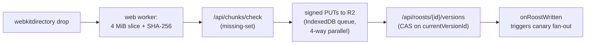

- chunking and hashing run off the main thread (`web/lib/chunking.ts`, worker at `web/lib/workers/versionBuilder.worker.ts`)
- the upload queue persists to IndexedDB (`web/lib/uploadQueue.ts`): close the tab at 50%, drop the same folder again, and it resumes from 50%
- the `admit` endpoint reserves `pendingBytes` atomically, so two concurrent uploads cannot both fit when their sum would exceed quota
- finalize is a Firestore transaction; compare-and-swap on `currentVersionId` serialises concurrent finalizes safely

### agent sync pipeline

agents receive `sync_pull` commands from roost fan-out, a manual deploy, resync or rollback. `cancel_sync` can ask an in-flight pull to stop gracefully, and `rollback_to_version` reuses the same sync path after the server flips the pointer to an older immutable version.

1. **version fetch** (`agent/src/sync_version.py`): pull the version body from R2, cache it under `versions/{versionId}.json` in the agent's data root, and diff it against the previous committed version to compute the chunk and file delta
2. **chunk download** (`agent/src/sync_downloader.py`): parallel workers (4 by default) with `Range: bytes=<offset>-` resume, per-chunk SHA-256 verification and signed-URL refresh on a 403
3. **atomic assembly** (`agent/src/sync_assembler.py`): write to `<path>.partial`, fsync, then `os.replace` (atomic). a post-rename realpath check guards against a TOCTOU symlink swap between the allowlist check and the rename landing
4. **scrub** (`agent/src/sync_scrub.py`): periodic re-hashing of files on disk against their manifest chunk hashes, to catch silent bit rot

every write is gated by the **destination allowlist** (`agent/src/destination_allowlist.py`), which fails closed: an empty or missing allowlist rejects all writes. symlinks, junctions, Windows reserved device names (NUL, CON, PRN…), alternate data streams and paths outside the allowed roots are rejected after realpath resolution, not by string matching alone.

during a sync, agents report per-target state to `sites/{siteId}/roosts/{roostId}/target_state/{machineId}` with statuses such as `pending`, `downloading`, `assembling`, `committed`, `failed` and `cancelled`.

### rollout strategy (canary-first)

every `currentVersionId` flip goes through a **staged rollout**, never all at once, so a bad version reaches a few canary machines before it reaches the fleet:

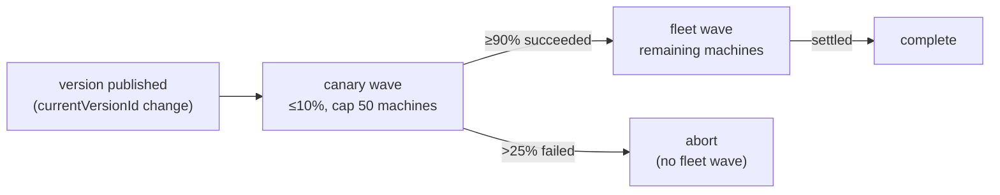

canary selection is deterministic (an FNV-1a hash of `machineId + versionId`), so trigger retries don't flap the chosen cohort. the abort threshold is measured against `total`, not `settled`, so a rollout already past the 25% failure mark stops at once without waiting for the remaining machines.

on a single-machine site the canary *is* the whole fleet: the canary wave holds the one target and the fleet wave is empty, so a passing canary settles straight to `complete` without a second wave. a failing one still aborts at the same threshold.

a deploy can also be scheduled: it waits at `stage: 'scheduled'` until `sweepScheduledRollouts` fires it into the canary wave.

### security floor

- **per-tenant signed-URL paths**: a signed URL issued for `site-a` cannot read `site-b`'s chunks, because paths are scoped before signing
- **allowlist**: fail-closed at the agent; the roots come from `agent_config.allowed_extract_roots` in the machine's `config.json`, and there is no dashboard editor
- **hash-chained audit log**: every `signed_url_issued` / `distribution_started` / `manifest_pointer_changed` / `api_key_used` / `gc_run` record embeds `hash(prev || canonicalPayload)`, so tamper detection survives deletion and mutation
- **no-token-logs lint gate**: `scripts/check-no-token-logs.mjs` blocks any commit that logs auth tokens (CI, plus an optional pre-commit hook)

### agent support

every agent from 3.0.0 on registers the roost v2 handlers `sync_pull`, `cancel_sync` and `rollback_to_version`, on all three platforms. the v2 sync path has no `project_url` fallback: legacy v1 project-distribution records can coexist in Firestore during migration, but only agents with the v2 handlers consume roost deploys.

---

## technology stack

| layer | technology |
|-------|-----------|
| **agent** | Python 3.11 (bundled: 3.11.8 on Windows, 3.11.16 on macOS and Linux), psutil, pywin32 on Windows |
| **service hosting** | owlette-host (Rust) on Windows, launchd on macOS, systemd on Linux |
| **desktop app** | Tauri 2 (Rust, with WebView2, WKWebView or WebKitGTK), React 19, TypeScript |
| **swoop streamer** | Rust, str0m (WebRTC), NVENC on Windows, VideoToolbox on macOS, Opus |
| **swoop signalling** | Cloudflare Workers with Durable Objects; Cloudflare STUN and Realtime TURN |
| **web** | Next.js 16, React 19, TypeScript 5, Tailwind CSS 4 |
| **UI components** | shadcn/ui (Radix UI), Recharts, Lucide React |
| **database** | Cloud Firestore (real-time NoSQL) |
| **object storage (roost)** | Cloudflare R2 (S3-compatible, free egress) |
| **auth** | Firebase Authentication, iron-session, TOTP and passkeys (WebAuthn) for the second factor |
| **email** | Resend API |
| **Cloud Functions** | Firebase Functions (2nd gen, Node.js 22) |
| **hosting** | Railway (web), with a failover origin behind a Cloudflare load balancer |
| **build** | Inno Setup (Windows `.exe`), productbuild (macOS `.pkg`), dpkg-deb (Linux `.deb`), Nixpacks (web), Wrangler (signalling worker) |
| **AI** | Vercel AI SDK, Anthropic Claude / OpenAI |
