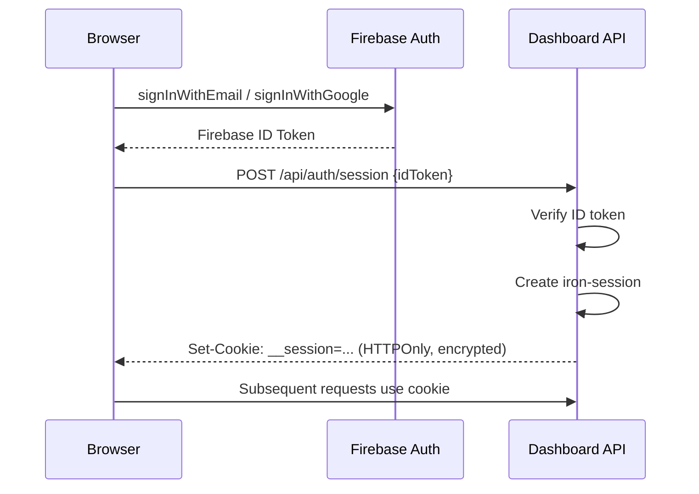
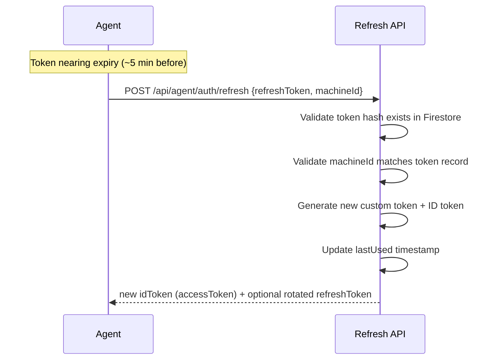
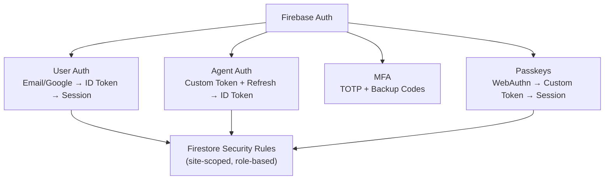

Owlette uses four authentication mechanisms: user auth (Firebase Auth), agent auth (device code pairing), passkey authentication (WebAuthn), and two-factor authentication, which every account must enroll in and which a passkey or an authenticator app can satisfy.

---

## user authentication

### sign-in flow



### session management

Sessions use [iron-session](https://github.com/vvo/iron-session) — encrypted, signed, HTTPOnly cookies.

| property | value |
|----------|-------|
| **Cookie name** | `__session` |
| **HTTPOnly** | Yes (not accessible from JavaScript) |
| **Secure** | Yes (HTTPS only in production) |
| **Encryption** | AES-256-GCM via `SESSION_SECRET` |

### sign-out

`DELETE /api/auth/session` clears the session cookie.

---

## agent authentication (device code pairing)

Agents authenticate using a device code flow with a two-token system. No Firebase service account keys are stored on client machines.

### pairing flow

```
1. Agent requests pairing phrase (POST /api/agent/auth/device-code)
   └── Server generates 3-word phrase (e.g., "silver-compass-drift")
       stored in device_codes/{phrase} with 10-minute expiry

2. User authorizes (POST /api/agent/auth/device-code/authorize)
   ├── Via browser opened by the operator on the machine (owlette.app/add)
   ├── Via dashboard "+" button → "Enter Code" tab
   ├── Via /ADD=phrase installer flag (pre-authorized, no interaction)
   ├── Server creates Firebase custom token with claims:
   │     {role: "agent", site_id: "...", machine_id: "..."}
   ├── Server exchanges custom token for ID token (Firebase Auth REST)
   ├── Server generates refresh token (random, hashed in Firestore)
   └── Stores the prepared credential bundle in the device_codes doc
       (encrypted blob for interactive pairing, plaintext for pre-authorized)

3. Agent polls for authorization (POST /api/agent/auth/device-code/poll)
   ├── Server reads the stored credential bundle from the device_codes doc
   ├── Returns it (encrypted blob for interactive pairing, plaintext
   │     accessToken + refreshToken + siteId for pre-authorized codes)
   └── Deletes the device-code doc

4. Agent stores tokens
   ├── Access token: used for Firestore REST API calls (1-hour expiry)
   └── Refresh token: encrypted locally with Fernet AES (machine-bound key)
```

### add machine modal (dashboard)

Operators can pair machines without using the installer's browser handoff by clicking the **"+"** button on the dashboard header. The `AddMachineButton` modal (see `web/app/dashboard/components/AddMachineButton.tsx`) exposes two tabs:

**Enter Code** — for operators who already have a pairing phrase (e.g. the installer, or the desktop app's **join a site** dialog, is showing `silver-compass-drift` on the target machine):

1. Type the three-word phrase into the input
2. Click **Authorize**
3. The modal `POST`s to `/api/agent/auth/device-code/authorize` with the current `siteId` — the agent's pending poll sees the authorization and completes pairing

**Generate Code** — for bulk or silent deployments where no one will be at the machine:

1. Click **Generate Pairing Phrase** — the modal calls `POST /api/agent/auth/device-code` then immediately authorizes the returned phrase for the current site (`POST /api/agent/auth/device-code/authorize`)
2. Copy the pre-authorized phrase, or copy the silent install command, which the modal formats as:

   `Owlette-Installer-v{version}.exe /ADD={phrase} /SILENT`

3. The phrase expires **10 minutes** after generation. Run the command on each target machine within that window and the agent will pair on first launch — nothing to click on the machine, no browser.

Both tabs work only while the viewer has write access to the currently-selected site.

---

### token refresh flow



### token security

| aspect | implementation |
|--------|---------------|
| **Refresh token storage** | Encrypted with Fernet AES, key derived from Windows `MachineGuid` |
| **Refresh token in Firestore** | Stored as SHA-256 hash (not plaintext) |
| **ID token lifetime** | 1 hour (Firebase custom token) |
| **Machine binding** | Refresh validates `machineId` matches — prevents token theft |
| **Token collections** | `device_codes`, `agent_tokens`, and `agent_refresh_tokens` are server-side only (no client access) |

### custom token claims

```json
{
  "role": "agent",
  "site_id": "nyc-office",
  "machine_id": "DESKTOP-ABC123"
}
```

Firestore security rules use these claims to scope agent access to a single site and machine.

---

## passkey authentication (webauthn)

Passkeys use the Web Authentication API (FIDO2) for passwordless login. A passkey replaces both the password and the 2FA code — it's a single biometric/PIN step.

"Passkey" is one standard, not a list of integrations. Windows Hello, Touch ID, Face ID, a hardware security key (YubiKey and friends), and password managers that store passkeys (1Password, Bitwarden, iCloud Keychain) are all WebAuthn authenticators, and Owlette treats them identically — there is nothing per-vendor to enable.

### registration flow

```
1. User is logged in, navigates to passkey management
   └── POST /api/passkeys/register/options
       ├── Generate WebAuthn registration challenge
       ├── Store in webauthn_challenges/{userId} (10-min expiry)
       └── Return PublicKeyCredentialCreationOptions

2. Browser prompts for authenticator (Touch ID, Windows Hello, phone)

3. User completes biometric/PIN
   └── POST /api/passkeys/register/verify
       ├── Verify attestation response
       ├── Store credential in users/{userId}/passkeys/{credentialId}
       ├── Recount users/{userId}.mfaFactors.passkeys (transactional)
       ├── If this is the account's FIRST factor, re-mint the session as
       │     MFA-verified (markSessionMfaVerified) — the ceremony just
       │     completed IS the proof, so there is no second prompt
       └── Delete challenge
```

### login with passkey

```
1. User clicks "passkey" on login page
   └── POST /api/passkeys/authenticate/options
       ├── Generate authentication challenge (discoverable)
       ├── Store in webauthn_challenges/{randomId} (10-min expiry)
       └── Return options + challengeId

2. Browser shows available passkeys for this site
   └── User selects and authenticates (biometric/PIN)

3. POST /api/passkeys/authenticate/verify
   ├── Verify assertion response against stored public key
   ├── Validate counter (clone detection)
   ├── Create iron-session (HTTPOnly cookie)
   ├── Create Firebase custom token
   ├── Client calls signInWithCustomToken()
   └── Session is minted MFA-verified (createSession(..., 'passkey-uv'))
         — a user-verified assertion is the second factor, so the user is
         never asked for a code on top of it
```

### passkey management

- Users can register multiple passkeys (e.g., laptop + phone)
- Each passkey has a friendly name, device type, creation date, last used date
- Rename: `PATCH /api/passkeys/{credentialId}`
- Delete: `DELETE /api/passkeys/{credentialId}`
- List: `GET /api/passkeys/list?userId=...`

### security

| aspect | implementation |
|--------|---------------|
| **RP ID** | `owlette.app` (prod), `localhost` (dev) |
| **Challenge lifetime** | 10 minutes, single-use, deleted after verification |
| **Clone detection** | Counter validation — rejects if response counter ≤ stored counter |
| **Credential storage** | Public key in `users/{userId}/passkeys/` subcollection |
| **User verification** | `required` (PIN or biometric mandatory) |
| **Discoverable credentials** | `residentKey: preferred` (no email needed to start login) |

---

## two-factor authentication (2fa)

Two-factor authentication is mandatory, and **either** factor type satisfies it — a user picks one at `/setup-2fa` and can add the other later.

| factor | what it actually is | at sign-in |
|--------|--------------------|------------|
| **passkey** (recommended) | Windows Hello, Touch ID, Face ID, a hardware security key, or a password manager that stores passkeys (1Password, Bitwarden, iCloud Keychain). All WebAuthn — one standard, no per-vendor setup. | One ceremony. The device unlock is the login *and* the second factor, so no code is ever requested on top of it. |
| **authenticator app** | A 6-digit TOTP code. Authenticator apps run on **desktop as well as mobile** — 1Password, Bitwarden, and Authy all ship desktop apps, so a phone is not required to enroll. | Password or Google sign-in first, then the code at `/verify-2fa`. |

### the factor inventory

`lib/mfaFactors.server.ts` is the **only** writer of the three fields that describe an account's 2FA state:

```
users/{userId}.mfaFactors       = { totp: boolean, passkeys: number }
users/{userId}.mfaEnrolled      = mfaFactors.totp || mfaFactors.passkeys > 0
users/{userId}.requiresMfaSetup = !mfaEnrolled
```

`mfaFactors` is a denormalized tally, so the session hot path can answer "does this account hold a second factor?" with one document read instead of counting the `passkeys` subcollection. Documents written before the field existed are recounted from the subcollection and healed on the next write.

An account with zero factors carries `requiresMfaSetup: true`, and `proxy.ts` redirects that session to `/setup-2fa` from any protected path.

### setup flow

```
1. User lands on /setup-2fa and chooses a method

2a. passkey branch
   ├── POST /api/passkeys/register/options then /verify
   ├── Credential stored, mfaFactors.passkeys recounted
   └── First factor: the session is re-minted MFA-verified in place

2b. authenticator branch
   ├── POST /api/mfa/setup
   │     ├── Generate TOTP secret
   │     ├── Store in mfa_pending/{userId} (10-min expiry)
   │     └── Return secret + QR code URL
   └── POST /api/mfa/verify-setup with the 6-digit code
         ├── Verify code against secret
         ├── Encrypt secret, store on users/{userId}
         ├── Issue and hash the first sheet of backup codes
         └── Delete the mfa_pending document

3. Both branches end at the backup-codes screen
```

### the enrollment gate

`lib/mfaEnrollmentGate.server.ts` guards `/api/mfa/setup`, `/api/mfa/verify-setup`, and the two `/api/passkeys/register/` routes:

- **zero factors** — enrollment is open. This is the mandatory-setup path; a user who has never enrolled cannot hold `mfaVerified`, so gating it would deadlock.
- **one or more factors** — the session must already be MFA-verified, otherwise the route returns `403` with `code: "mfa_challenge_required"` and the client sends the user to `/verify-2fa`. Without this, a stolen session cookie could attach an attacker-controlled factor and clear the gate with it.

Removal routes are deliberately outside the gate — see [removing a factor](#removing-a-factor).

### login with 2fa

```
1. User signs in (email/password, Google, or passkey)
2. Passkey sign-in: the session is minted MFA-verified, so there is no prompt
3. Otherwise the dashboard reads mfaEnrolled: true and prompts at /verify-2fa
4. POST /api/mfa/verify-login {code}
   ├── Decrypt secret from user document
   ├── Verify TOTP code (or check backup codes)
   ├── If backup code used: remove from list
   └── Return success
```

A user who holds a passkey can clear that prompt with the passkey instead of typing a code, via the `/api/passkeys/step-up/` routes.

### backup codes

- 10 single-use codes, stored as hashes — the plaintext is shown exactly once
- Available to **any** enrolled account, not just TOTP ones. A passkey-only account gets its sheet from `POST /api/mfa/backup-codes`
- Regenerating invalidates every previously issued code
- Regeneration requires **live proof of possession** in the same request — a current TOTP code, an unused backup code, or a passkey assertion. A warm session is deliberately not enough: a sheet of recovery codes also satisfies `/api/mfa/disable`, so minting one from a cookie alone would be a way to shed 2FA entirely

### removing a factor

Removing your last factor is **allowed**. On a drop to zero factors the inventory module re-arms `requiresMfaSetup`, so the account goes straight back into mandatory setup and the user is asked to enroll a new factor before they can use the dashboard again. Dropping to zero also revokes every trusted-device record — 30-day device trust must not outlive the factor it was granted against.

The two removal routes are gated differently, and both deliberately so:

- `POST /api/mfa/disable` (authenticator app) demands live proof of possession every time — a current TOTP code or an unused backup code.
- `DELETE /api/passkeys/{credentialId}` requires only the session that owns the credential. It is **not** behind the enrollment gate: that gate exists to stop an unchallenged session from *adding* a factor it could then step up with, and refusing a removal would hold an account hostage to a credential its owner no longer has.

### superadmin factor reset

`POST /api/users/{uid}/mfa-reset` — surfaced as **reset 2FA** on the row menu of `/admin/users` — is the supported recovery path for a user who has lost their last factor *and* their backup codes. It deletes every passkey credential, clears the TOTP secret and backup codes, re-arms mandatory setup, and revokes the target's trusted-device records.

It does **not** revoke Firebase refresh tokens: a session the target already holds stays signed in until it expires on its own. Self-reset is refused — a superadmin uses account settings for their own factors, or asks another superadmin.

---

## role-based access control

Owlette uses a three-tier model for human users (plus a separate agent tier for service accounts):

### roles

| role | platform | site access | typical usage |
|------|----------|-------------|---------------|
| **member** | none | read-only on assigned sites | viewers, read-only ops |
| **admin** | none | write on assigned sites (reboot, delete machines, edit display layouts, site settings) | site operators delegated by platform admins |
| **superadmin** | full Admin Panel (user management, installer uploads, etc.) | implicit access to every site | platform administrators |
| **agent** | — | single site + single machine (custom token claims) | Owlette agent service accounts |

New users default to `member`. Superadmins promote members to `admin` or `superadmin` from `/admin/users`.

### enforcement layers

1. **Firestore Security Rules** — Database-level enforcement (cannot be bypassed). Helpers: `isSuperadmin()`, `isSiteAdmin(siteId)`, `canAccessSite(siteId)`. See [firestore-rules.md](/docs/setup/firestore-rules#key-functions).
2. **API Route Middleware** — Server-side helpers resolve sessions, Firebase ID tokens, and `owk_*` API keys. Public API routes use resource-scoped helpers such as `requireSiteAuthAndScope`, `requireMachineAuthAndScope`, `requireChatAuthAndScope`, and lower-level `resolveAuth`/`requireScope`; roost-specific routes use the same scoped-auth pattern. `requireAdminOrIdToken` is reserved for legacy or superadmin-gated platform routes.
3. **React Components** — `RequireAdminAccess` gates the admin panel, with `minRole` naming the tier (`superadmin` for platform-scoped routes, `admin` for site-scoped ones); `useAuth().isSiteAdmin(siteId)` for site-scoped UI gates.

### how role is determined

```
User logs in → Firebase Auth ID token
  │
  POST /api/auth/session → Server creates the iron-session cookie
  │     (userId + MFA state only — the cookie does NOT carry role)
  │
  └── AuthContext separately subscribes to users/{uid} in Firestore
        via onSnapshot → reads the live role field there
```

---

## security architecture


