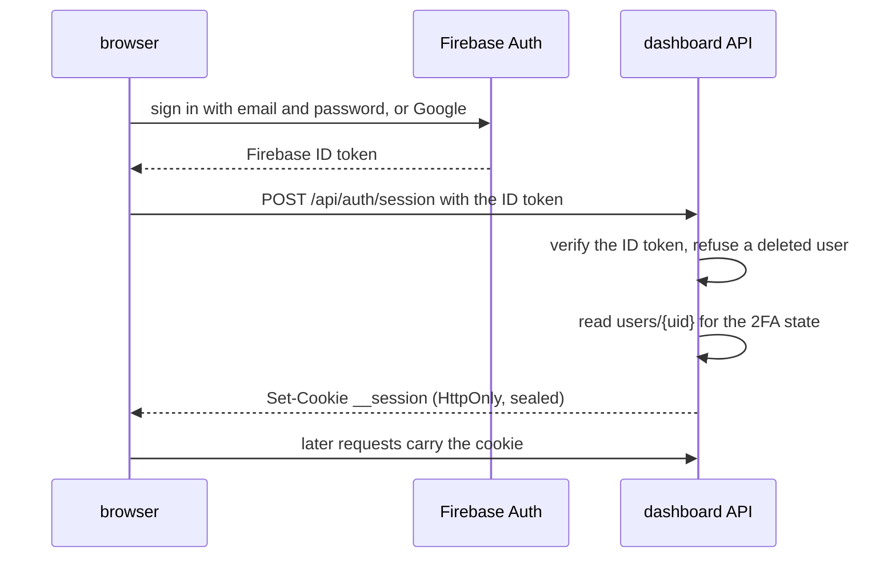
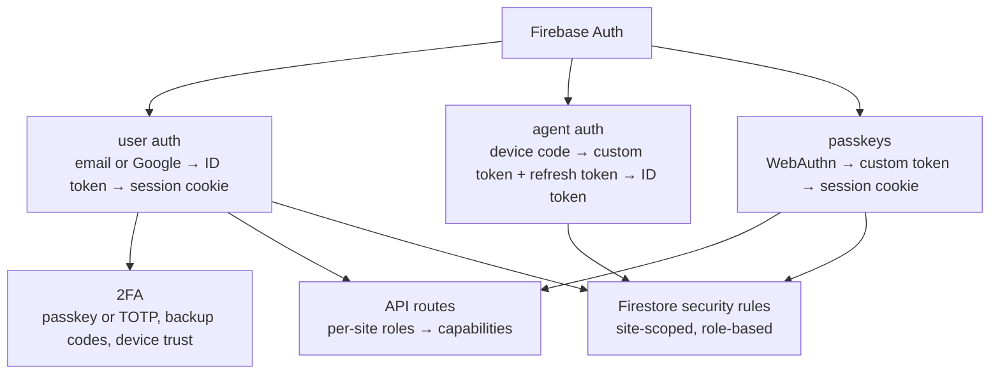

owlette has four ways in: a browser session for people, device-code pairing and refresh tokens for agents, passkeys, and the two-factor check every account must pass. scoped `owk_*` API keys, bearer headers and API error behaviour are in [API authentication](/docs/api/authentication).

---

## user authentication

### sign-in flow


```mermaid
sequenceDiagram
    participant B as browser
    participant F as Firebase Auth
    participant D as dashboard API
    B->>F: sign in with email and password, or Google
    F-->>B: Firebase ID token
    B->>D: POST /api/auth/session with the ID token
    D->>D: verify the ID token, refuse a deleted user
    D->>D: read users/{uid} for the 2FA state
    D-->>B: Set-Cookie __session (HttpOnly, sealed)
    B->>D: later requests carry the cookie
```

### the session cookie

sessions are [iron-session](https://github.com/vvo/iron-session) cookies: sealed and signed on the server, unreadable from JavaScript.

| property | value |
|----------|-------|
| **name** | `__session` |
| **holds** | the user ID, the session's expiry and its 2FA state (`mfaRequired`, `mfaVerified`, `mfaCompletedAt`, `mfaSatisfiedBy`, `requiresMfaSetup`). no role |
| **sealing** | iron-session v8's defaults: AES-256-CBC with an HMAC-SHA256 integrity check, keyed by `SESSION_SECRET`. the secret must be at least 32 characters; the server throws on load without it |
| **flags** | `HttpOnly`, `SameSite=Lax`, path `/`, and `Secure` in production |
| **lifetime** | `POST /api/auth/session` takes `durationDays`, 1 to 30 (default 7), for the session's own expiry, but the cookie's max age is fixed at 7 days, so a longer session still ends with the cookie |

`POST /api/auth/session` is limited to 10 requests a minute per IP. `GET` reports the session's state and `DELETE` signs out.

### remembering a device

clearing a code at `/verify-2fa` with **trust this device** (`trustDevice: true`) sets a second cookie, `owlette_device_trust`, for 30 days. it holds a random 256-bit token; the server keeps only its SHA-256 hash, in `users/{uid}/trustedDevices/{hash}`. a later sign-in from that browser starts MFA-verified, recorded as `mfaSatisfiedBy: "device-trust"`, so [swoop's](/docs/dashboard/swoop#the-second-factor) step-up, which wants a live ceremony, still asks. dropping to zero factors, and a superadmin reset, revoke every trust record.

### signing in owlette swoop

[owlette swoop](/docs/dashboard/swoop#owlette-swoop), the desktop viewer app, keeps its own cookie jar, apart from the browser's, so it signs in through a browser that already holds a session, with a one-time code. a code is 32 random bytes, stored only as its SHA-256 in `app_links/{hash}` (server only) and never logged.

- **from the dashboard**: `POST /api/auth/app-link`, from a session that has passed two-factor, mints an approved code that lives 60 seconds. it rides the `owlette-swoop://<host>/app-link?code=…&next=/swoop/<site>/<machine>` link, and the app's `/app-link` page exchanges it
- **from the app**: **sign in with your browser** calls `POST /api/auth/app-link/start`, which returns a pending code, a poll secret and the page `/app-link/approve?code=…`, all good for 10 minutes. the app opens that page in the system browser, where a user whose session has passed two-factor approves it, and polls `POST /api/auth/app-link/exchange` with the code and its secret

an exchange is single use, never names the uid, and answers a Firebase custom token whose `appLinkMfa` claim carries the approver's `mfaSatisfiedBy`. `POST /api/auth/session` honours the claim only for a custom-token sign-in made in the last 5 minutes, so the app's session has the approver's two-factor state. a `device-trust` approver therefore gives a `device-trust` app session, which answers swoop's step-up with a code in the app; any other can use **verify in your browser**, which passes the ceremony at `/swoop/<site>/<machine>/verify` in the system browser and opens the same 12-hour window for that user and machine while the app polls `GET …/swoop/step-up`.

---

## agent authentication

an agent holds a one-hour Firebase ID token for its Firestore and API calls, and a long-lived refresh token to get the next one. no service-account key is ever on a machine.

### pairing

```
1. the agent asks for a phrase: POST /api/agent/auth/device-code
   └── body: machineId, version
       the server stores device_codes/{phrase} for 10 minutes: the 3-word
       phrase, sha256(deviceCode), and the device code itself
       returns pairPhrase, deviceCode (64 random bytes), pairingUrl,
       expiresIn 600, interval 5

2. someone authorizes the phrase: POST /api/agent/auth/device-code/authorize
   ├── body: pairPhrase, siteId. needs a dashboard session holding
   │     MACHINE_ENROLL on that site: a site owner or admin, or a superadmin
   ├── mints the agent's Firebase custom token and ID token
   ├── creates a random refresh token, kept only as its SHA-256 hash in
   │     agent_refresh_tokens/{hash}
   └── encrypts accessToken, refreshToken, expiresIn and siteId with
         AES-256-GCM under HKDF-SHA256(deviceCode, salt = the phrase,
         info = "owlette-device-code-v1"), then deletes the stored device code

3. the agent polls every 5 seconds: POST /api/agent/auth/device-code/poll
   ├── body: deviceCode
   ├── 202 pending · 410 expired · 404 unknown
   └── 200 with the encrypted bundle; the document is deleted in the same
         transaction, so a bundle is handed out once

4. the agent decrypts the bundle with its device code and writes the tokens
   to .tokens.enc
```

the phrase alone cannot fetch those credentials: once an interactive phrase is authorized, a poll by phrase is refused with `403`.

the agent no longer opens a browser on the machine. the owlette app, the installer console or `configure_site.py` shows the phrase and its link, and you authorize from any device: **join a site** in the app, `owlette.app/add`, or the dashboard. `--no-browser` and `OWLETTE_NO_BROWSER=1` are still accepted and change nothing. the agent's machine ID, which the tokens are bound to, is kept in `config/machine_id`, seeded from the hostname the first time it is read.

### pre-authorized phrases

for a machine nobody is standing at, an admin makes the phrase first:

- **generate code** in the dashboard calls the device-code route from a signed-in session, which marks the document `preauthorizedIntent` and stores no device code, then authorizes it at once. that authorization only records the site and who approved it, with `deferTokenMint: true`; no token exists yet
- the machine polls with the phrase, its `machineId` and `version`. the first poll after authorization claims the phrase for that machine ID for 60 seconds, mints tokens bound to it, deletes the document and returns `accessToken`, `refreshToken`, `expiresIn: 3600` and `siteId` over TLS. another machine polling the same phrase meanwhile gets `202`, and `404` once it is spent: one phrase pairs one machine
- a document from an older server that still holds plaintext tokens is redeemed by phrase too; nothing writes one now

how the phrase reaches the machine depends on its platform:

| | Windows | macOS | Linux |
|---|---|---|---|
| **how** | `Owlette-Installer-v<version>.exe /ADD=<phrase> /SILENT`. on dev.owlette.app the dashboard's command carries `/SERVER=dev` too | `config/pairing.json` in the data root before the package installs, with `phrase` and optionally `server` and `kiosk_user` | the same |
| **what runs it** | the installer runs `configure_site.py --add` | the package's postinstall runs `configure_site.py --preseed` in the background | the package's postinst does the same |

the **generate code** dialog shows both: the Windows command, and the preseed's contents for macOS and Linux; [installation](/docs/agent/installation#the-pairing-preseed-macos-and-linux) has the paths and commands. `kiosk_user` is only reported in the pairing log: it does not add that account to the `owlette` or `_owlette` group, which you still do by hand. a machine that already has a site is never re-paired by the file; `OWLETTE_ADD=<phrase>` in the environment of `configure_site.py --preseed` takes the file's place and does re-pair it.

### the add machine dialog

the **+** (**add machine**) button on the dashboard opens two tabs, both for the site you have selected:

- **enter code**: type the phrase a machine is showing and **authorize**. the dialog posts it to the authorize route with the site ID, and the machine's next poll completes the pairing
- **generate code**: makes a pre-authorized phrase, as above, and shows it with the Windows silent install command and the macOS and Linux pairing preseed. it expires 10 minutes after it was made

every site member sees the button, but authorizing needs `MACHINE_ENROLL`, so a plain member's attempt is refused. generating a phrase spends two requests from the budget below.

### tokens after pairing

| token | lifetime | notes |
|-------|----------|-------|
| **access token** | 1 hour | a Firebase ID token carrying the custom claims below. the agent refreshes it when less than 5 minutes remain |
| **refresh token** | no expiry | random, stored on the server only as its SHA-256 hash, bound to one machine ID. revocable by a site admin |

`POST /api/agent/auth/refresh` takes `refreshToken` and `machineId`. the server checks the hash exists, has not passed an `expiresAt` (current tokens have none), has not been superseded beyond its grace, and was issued to that machine ID: another machine ID gets `403`. it re-sets the agent's claims and returns a new access token.

**rotation.** an agent that sends `X-Owlette-Agent-Version` 2.12.0 or later gets a new refresh token on every refresh. the old one keeps working for 5 minutes, so a lost response can be retried, and the one before it is deleted once it can no longer be presented, which keeps about two records per machine. an older agent, or a missing header, keeps its token and only bumps `lastUsed`.

**revocation.** site admins list a site's tokens with `GET /api/sites/{siteId}/agent-tokens` and revoke with `POST /api/sites/{siteId}/agent-tokens/revoke`, naming exactly one of `tokenId`, `machineId` (optionally with `latestOnly`), `all: true` or `prune: true`. both need `AGENT_TOKEN_REVOKE`. see [token management](/docs/dashboard/admin/token-management).

**losing the token.** a `401` or `403` answer to a refresh makes the agent wipe its token store, and the machine has to pair again. a revocation therefore lands at the machine's next refresh: the access token it already holds keeps working until then, for up to an hour.

**rate limits**, per IP, with the shared Redis limiter configured: device-code, authorize and the legacy exchange share 60 requests an hour (200 on dev), polling counts against the general 300 an hour, and refresh allows 120 an hour. without Redis every endpoint falls back to 15 a minute per process.

### custom token claims

```json
{
  "role": "agent",
  "site_id": "nyc-office",
  "machine_id": "DESKTOP-ABC123",
  "version": "4.1.5"
}
```

the security rules read these to limit an agent to its own site and machine (`agentCanAccessMachine`).

### the token file

the refresh token, the cached access token and its expiry, and the site ID are kept together in one encrypted file, `.tokens.enc`, in the agent's data root.

| | Windows | macOS | Linux |
|---|---|---|---|
| **path** | `C:\ProgramData\Owlette\.tokens.enc` | `/Library/Application Support/Owlette/.tokens.enc` | `/var/lib/owlette/.tokens.enc` |
| **key material** | the machine's `MachineGuid` | the hardware `IOPlatformUUID`, with no fallback: when it cannot be read, the store is left untouched | `/etc/machine-id`, else `/var/lib/dbus/machine-id`, else an ID derived from a network interface |
| **file protection** | hidden, with a protected DACL: SYSTEM and Administrators, plus modify for the account that wrote it or the console user | mode `0600`, owned by root and opened without following links, inside a `0750` data root owned by group `_owlette` | the same, group `owlette` |

the file is Fernet-encrypted (AES-128-CBC with HMAC-SHA256) under `base64url(SHA-256(key material + ":owlette-agent"))`, so it is useless on any other machine. an earlier derivation also mixed in the hostname, which a rename moved out from under the store; the agent re-encrypts such a file the first time it reads it and keeps the old copy as `.tokens.enc.v1`. setting `OWLETTE_DATA_ROOT` moves the whole data root, the token file included, for the Python agent; the owlette app reads it only from its own environment, and `owlette-host` ignores it.

### legacy registration codes

`POST /api/agent/auth/exchange` still trades a one-time registration code, from `agent_tokens/{code}`, for the same pair of tokens. the codes last 24 hours and are written by `/api/setup/generate-token` and `/api/agent/generate-installer`. no current agent calls the exchange.

---

## passkey authentication (WebAuthn)

passkeys use the Web Authentication API (FIDO2) for passwordless sign-in. one passkey ceremony replaces both the password and the 2FA code.

"passkey" is one standard, not a list of integrations. Windows Hello, Touch ID, Face ID, a hardware security key, and password managers that store passkeys (1Password, Bitwarden, iCloud Keychain) are all WebAuthn authenticators, and owlette treats them the same: there is nothing per vendor to turn on.

### registration flow

```
1. a signed-in user opens passkey management
   └── POST /api/passkeys/register/options
       ├── generates a registration challenge
       ├── stores it in webauthn_challenges/{userId} (10 minutes)
       └── returns PublicKeyCredentialCreationOptions

2. the browser asks the authenticator, and the user unlocks it

3. POST /api/passkeys/register/verify
   ├── verifies the attestation, with user verification required
   ├── stores the credential in users/{userId}/passkeys/{credentialId}
   ├── recounts users/{userId}.mfaFactors.passkeys (in a transaction)
   ├── for the account's FIRST factor, re-mints the session as MFA-verified:
   │     the ceremony just completed is the proof, so there is no second prompt
   └── deletes the challenge
```

### sign-in with a passkey

```
1. the user chooses passkey on the login page
   └── POST /api/passkeys/authenticate/options
       ├── generates a discoverable-credential challenge
       ├── stores it in webauthn_challenges/{randomId} (10 minutes)
       └── returns the options and a challengeId

2. the browser offers this site's passkeys; the user picks one and unlocks it

3. POST /api/passkeys/authenticate/verify
   ├── verifies the assertion against the stored public key
   ├── checks the signature counter (clone detection)
   ├── creates the session cookie, MFA-verified as "passkey-uv": a
   │     user-verified assertion is the second factor, so no code follows
   ├── creates a Firebase custom token
   └── the client calls signInWithCustomToken()
```

### managing passkeys

- an account can hold several passkeys, each with a name, device type, creation date and last-used date
- list: `GET /api/passkeys/list?userId=...`
- rename: `PATCH /api/passkeys/{credentialId}` with `userId` and `friendlyName` (50 characters at most)
- delete: `DELETE /api/passkeys/{credentialId}?userId=...`

each needs the signed-in session of that `userId`.

### security

| aspect | implementation |
|--------|----------------|
| **RP ID** | `owlette.app` in production, accepted from both `https://owlette.app` and `https://dev.owlette.app`; `localhost` in development |
| **challenges** | 10 minutes, single use, deleted after verification |
| **clone detection** | the presented counter must be higher than the stored one, except when both are 0, which many synced passkeys always report; then there is no counter check |
| **credential storage** | the public key, in the `users/{userId}/passkeys/` subcollection |
| **user verification** | `required`: a PIN or biometric every time |
| **discoverable credentials** | `residentKey: preferred`, so sign-in can start without an email address |

---

## two-factor authentication (2FA)

two-factor authentication is mandatory, and **either** kind of factor satisfies it: a user picks one at `/setup-2fa` and can add the other later.

| factor | what it is | at sign-in |
|--------|------------|------------|
| **passkey** (recommended) | Windows Hello, Touch ID, Face ID, a hardware security key, or a password manager that stores passkeys. all WebAuthn, with no per-vendor setup | one ceremony. unlocking the device is the sign-in *and* the second factor, so no code is asked for on top |
| **authenticator app** | a 6-digit TOTP code. authenticator apps run on desktops as well as phones (1Password, Bitwarden and Authy all ship desktop apps), so a phone is not required | password or Google sign-in first, then the code at `/verify-2fa` |

### the factor inventory

`lib/mfaFactors.server.ts` is the **only** writer of the three fields that describe an account's 2FA state:

```
users/{userId}.mfaFactors       = { totp: boolean, passkeys: number }
users/{userId}.mfaEnrolled      = mfaFactors.totp || mfaFactors.passkeys > 0
users/{userId}.requiresMfaSetup = !mfaEnrolled
```

`mfaFactors` is a running tally, so the session path answers "does this account hold a second factor?" with one document read instead of counting the `passkeys` subcollection. documents written before the field existed are recounted from the subcollection and healed on their next write.

an account with no factors carries `requiresMfaSetup: true`, and `proxy.ts` sends that session to `/setup-2fa` from any protected path. `GET /api/mfa/factors` returns the signed-in account's inventory for the security panel, `totp`, `passkeys`, `totalFactors` and `mfaVerified`, with no secrets in it.

### setup flow

```
1. the user lands on /setup-2fa and chooses a method

2a. passkey
   ├── POST /api/passkeys/register/options, then /verify
   ├── the credential is stored and mfaFactors.passkeys recounted
   └── as the first factor, the session is re-minted MFA-verified in place

2b. authenticator app
   ├── POST /api/mfa/setup
   │     ├── generates a TOTP secret
   │     ├── stores it in mfa_pending/{userId} (10 minutes)
   │     └── returns the secret and a QR code URL
   └── POST /api/mfa/verify-setup with the 6-digit code
         ├── checks the code against the secret
         ├── encrypts the secret and stores it on users/{userId}
         ├── issues the first sheet of backup codes, stored hashed
         └── deletes the mfa_pending document

3. both end at the backup-codes screen
```

### the enrollment gate

`lib/mfaEnrollmentGate.server.ts` guards `/api/mfa/setup`, `/api/mfa/verify-setup` and the two `/api/passkeys/register/` routes:

- **no factors**: enrollment is open. this is the mandatory-setup path; a user who has never enrolled cannot hold `mfaVerified`, so gating it would deadlock
- **one or more factors**: the session must already be MFA-verified, or the route answers `403` with `code: "mfa_challenge_required"` and the client sends the user to `/verify-2fa`. without this, a stolen session cookie could attach an attacker's factor and clear the gate with it

removal is deliberately outside the gate; see [removing a factor](#removing-a-factor).

### sign-in with 2FA

```
1. the user signs in with email and password, Google, or a passkey
2. a passkey sign-in is minted MFA-verified, so there is no prompt
3. otherwise a session for an enrolled account is sent to /verify-2fa
   (a browser with a valid device-trust cookie starts verified instead)
4. POST /api/mfa/verify-login with userId, code, isBackupCode?, trustDevice?
   ├── needs the session of that userId
   ├── decrypts the TOTP secret on the server
   ├── checks the code, or the backup code, which is then removed
   ├── marks the session MFA-verified
   └── with trustDevice, sets the 30-day owlette_device_trust cookie
```

a user who holds a passkey can answer that prompt with it instead of a code, through the `/api/passkeys/step-up/` routes.

### backup codes

- 10 single-use codes, stored as hashes; the plaintext is shown exactly once
- available to **any** enrolled account, not only TOTP ones. a passkey-only account gets its sheet from `POST /api/mfa/backup-codes`
- regenerating invalidates every code issued before
- regenerating needs **live proof of possession** in the same request: a current TOTP code, an unused backup code, or a passkey assertion. a warm session is deliberately not enough, because a sheet of recovery codes also satisfies `/api/mfa/disable`, so minting one from a cookie alone would be a way to shed 2FA entirely

### removing a factor

removing your last factor is **allowed**. on a drop to zero factors the inventory module re-arms `requiresMfaSetup`, so the account goes straight back into mandatory setup and must enroll a new factor before it can use the dashboard again. dropping to zero also revokes every trusted-device record: 30-day device trust must not outlive the factor it was granted against.

the two removal routes are gated differently, both on purpose:

- `POST /api/mfa/disable` (authenticator app) demands live proof of possession every time: a current TOTP code or an unused backup code
- `DELETE /api/passkeys/{credentialId}?userId=...` needs only the session that owns the credential. it is **not** behind the enrollment gate: that gate stops an unchallenged session from *adding* a factor it could then step up with, and refusing a removal would hold an account hostage to a credential its owner no longer has

### superadmin factor reset

`POST /api/users/{uid}/mfa-reset`, the **reset 2FA** item on a row's menu at `/admin/users`, is the recovery path for a user who has lost their last factor *and* their backup codes. it deletes every passkey credential, clears the TOTP secret and backup codes, re-arms mandatory setup, and revokes the target's trusted-device records.

it does **not** revoke Firebase refresh tokens: a session the target already holds stays signed in until it expires on its own. self-reset is refused: a superadmin uses account settings for their own factors, or asks another superadmin.

---

## roles and access

a person has a **global** role and, on each site they belong to, a **site** role. only one global role carries authority: `superadmin`, which holds every capability on every site without any member rows. every other global value (`member` or `admin`, being narrowed to `user`) grants self-service only: your own preferences and deleting your own account. a global `admin` gives nothing on a site.

what you can do on a site comes from your row in `sites/{siteId}/members/{uid}`:

| site role | capabilities |
|-----------|--------------|
| **member** | `MACHINE_VIEW` (screenshots and live view) and `MACHINE_REMOTE_VIEW` (watching swoop, where the site lets members watch). read-only otherwise |
| **admin** | a member's, plus `MACHINE_EXEC_COMMAND`, `MACHINE_REMOTE_CONTROL`, `SWOOP_SETTINGS_MANAGE`, `MACHINE_CONFIG_WRITE`, `MACHINE_REMOVE`, `MACHINE_ENROLL`, `AGENT_TOKEN_REVOKE`, `DEPLOYMENT_MANAGE`, `DISTRIBUTION_MANAGE`, `UNINSTALL_TRIGGER`, `PRESET_MANAGE`, `WEBHOOK_MANAGE`, `SITE_LOGS_MANAGE`, `SITE_MEMBER_MANAGE`, `TALON_MANAGE` and `ALERT_RULES_MANAGE` |
| **owner** | an admin's, plus `SITE_DELETE` |

the platform capabilities, `USER_ROLE_MANAGE`, `USER_DELETE`, `INSTALLER_MANAGE`, `SYSTEM_PRESET_MANAGE` and `GLOBAL_SETTINGS_WRITE`, belong to superadmins alone. an **agent** reaches only its own site and machine, from its token's claims. server jobs act as system actors with fixed grants: unattended hoot (`cortex_autonomous`) may run commands and write machine config, the talon runner may run commands, and scheduled cleanup may remove machines and manage deployments.

superadmins set global roles at `/admin/users` ([user management](/docs/dashboard/admin/user-management#the-role-model)); site owners and admins set site roles with `PATCH /api/sites/{siteId}/members/{uid}` — the members page shows its role control to superadmins only ([member management](/docs/dashboard/admin/member-management#what-the-roles-mean)).

### enforcement layers

1. **Firestore security rules**, for what a browser or an agent reads and writes directly. helpers include `isSuperadmin()`, `isActiveMember(siteId)`, `canAccessSite(siteId)`, `isSiteAdmin(siteId)` and `agentCanAccessMachine(siteId, machineId)`; see [the key functions](/docs/setup/firestore-rules#key-functions). the server's Admin SDK bypasses the rules, so every route checks for itself
2. **API routes.** most run through `authorizedSiteHandler` or `authorizedPlatformHandler` (`lib/authorizedHandler.server.ts`): resolve the caller from a session, a Firebase ID token or an `owk_*` key, resolve their standing on the site, check the API key's scope, check the capability, apply the rate limit, write a blocking audit row, then run the handler. other routes use the `require*AuthAndScope` helpers in `app/api/_shared.ts` (site, machine, roost, chat, platform), and session-only routes, such as 2FA, passkeys and pairing authorization, use `requireSession` with an explicit capability check
3. **the dashboard**, for what it shows: `RequireAdminAccess` gates the admin panel, where `minRole: "admin"` admits anyone who administers at least one site and `minRole: "superadmin"` only superadmins, and `useAuth().isSiteAdmin(siteId)` gates per-site controls. these only hide things; the server decides

the `capability_enforcement` kill switch in `global/security_config` can turn capability checks off so a misfire cannot lock operators out of their fleet. it never turns off `MACHINE_REMOTE_CONTROL`, `MACHINE_REMOTE_VIEW` or `SWOOP_SETTINGS_MANAGE`, nor API-key scope checks, and every bypass is written to the audit row.

### how the dashboard learns your standing

```
sign-in → Firebase ID token
  │
  POST /api/auth/session → the session cookie
  │     (user id and 2FA state only: the cookie carries no role)
  │
  ├── AuthContext listens to users/{uid}: the global role
  └── useSiteMemberships listens to one collection-group query over
        members, filtered on uid: your role on every site
```

the server never trusts either: each request resolves the caller's role on the site it names.

---

## security architecture


```mermaid
flowchart TD
    FA[Firebase Auth]
    FA --> UA["user auth<br/>email or Google → ID token → session cookie"]
    FA --> AA["agent auth<br/>device code → custom token + refresh token → ID token"]
    FA --> PK["passkeys<br/>WebAuthn → custom token → session cookie"]
    UA --> MFA["2FA<br/>passkey or TOTP, backup codes, device trust"]
    UA --> API["API routes<br/>per-site roles → capabilities"]
    PK --> API
    AA --> FS["Firestore security rules<br/>site-scoped, role-based"]
    UA --> FS
    PK --> FS
```
